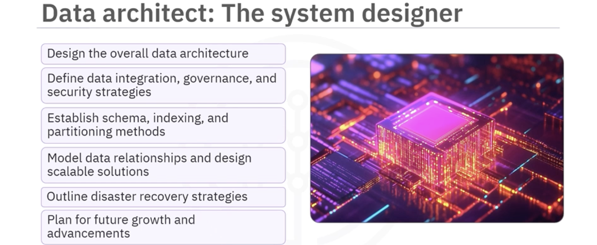
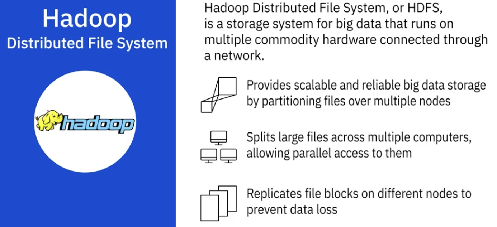
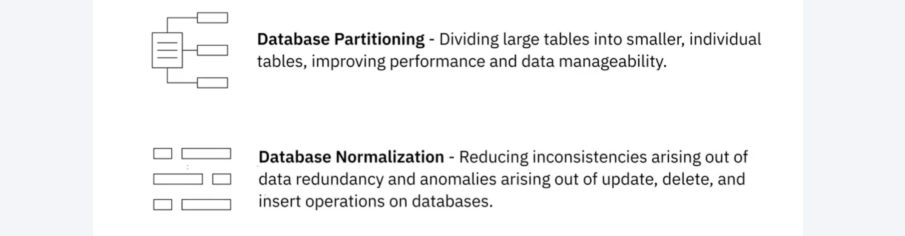

# Introduction to Data Engineering  
## Data Engineering  
- Goal: Make quality data available for fact-finding and business decision-making.  
## Data Roles  
- Data  
    - DE  
      
      
    - DA  
      
      
    - DS  
      
      
    - BA/BI  
      
      
    - Roles  
      
- Data Engineering  
    - Data Warehouse Engineer  
      
    - Data Architect  
      
    - Data Manager  
      
    - Database Administrator  
      
      
    - Roles  
    
- Data-related roles relationships
  
## DE Skills  
  
> - Data engineering requires a broad set of skillsets. 
> - **No one data engineer can possibly master each one of these skills**, which means you essentially need to **select one or more specialization areas**, but have a good understanding of all areas so that you can make more informed decisions. 
> - Your skills will grow over time with experience, the areas you choose to focus on, and the time you invest in upskilling yourself.  

1. OS  
  
2. Infrastructure Components  
  
3. Database  
  
4. Data Pipeline  
  
5. ETL Tools  
  
6. Language  
  
7. Big Data Process  
  
## Data Ecosystem  
- Data Repositories  
    > Data repositories help to isolate data and make reporting and analytics more efficient and credible while also serving as a data archive.  
    > - OLTP  
    >   
    > - OLAP  
    >   
    1. RDBMS
        > ACID: Atomicity, Consistensy, Isolation, Durability.  
    2. NoSQL  
        - Key-value store  
        - Document based  
        - Column based  
        - Graph based  
    3. Data Warehouses
        - A data warehouse is a central repository of data integrated from multiple sources.  
        - Data warehouses serve as the single source of truth, storing current and historical data that has been cleansed, conformed, and categorized.  
        - When data gets loaded into the data warehouse, it is already modeled and structured for a specific purpose, meaning it's analysis-ready.  
        - Architecture  
          
        - Vendors  
          
    4. Data Marts  
          
        - Dependent data marts are a sub-section of an enterprise data warehouse.  
        - Independent data marts are created from sources other than an enterprise data warehouse, such as internal operational systems or external data.  
        - Hybrid data marts combine inputs from data warehouses, operational systems, and external systems.  
        - Goals  
          
    5. Data Lakes  
          
          
## Big Data  
  
- Hadoop  
    - Hadoop is a collection of tools that provides distributed storage and processing of big data.  
      
- Hive  
    - Hive is a data warehouse for data query and analysis built on top of Hadoop.   
      
      
- Spark  
    - Spark is a distributed data analytics framework designed to perform complex data analytics in real-time.  
      
      
## Data Platform Architecture  
  
- Security  
    - The CIA Triad 
          
    - Physical Infrastructure Security  
    - Network Security  
    - Application Security  
    - Data Security  
## Data Engineering Lifecycle  
- Data wrangling
    - Data wrangling, also known as data munging, is an iterative process that involves data exploration, transformation, validation, and making data available for a credible and meaningful analysis.  
    - Data Wrangling involves a whole range of transformations and cleansing activities performed on the data. 
        - Transformation of raw data includes the tasks you undertake to:  
            - Structurally manipulate and combine data using Joins and Unions.  
            - Normalize data, that is, clean the database of unused and redundant data.  
            - Denormalize data, that is, combine data from multiple tables into a single table so that it can be queried faster.  
        - Cleansing activities include:  
            - Profiling data to uncover anomalies and quality issues.  
            - Visualizing data using statistical methods in order to spot outliers.  
            - Fixing issues such as missing values, duplicate data, irrelevant data, inconsistent formats, syntax errors, and outliers.  
> Imputation: calculates the missing value based on statistical values.  

- Performance tuning and troubleshooting  
    - Data Pipeline Performance Metrics  
      
      
    - Databases Performance Metrics  
      
    - Databases Optimization Practices  
      
      
- Governance and Compliance (治理 & 合规)  
    - Governance
        - Data Governance is a collection of principles, practices, and processes to maintain the security, privacy, and integrity of data through its lifecycle.  
          
          
    - Compliance
          
    - Governance and Compliance in Data Lifecycle
        - Compliance requires organizations to maintain an auditable trail of personal data through its lifecycle, which includes acquisition, processing, storage, sharing, retention, and disposal of data.  
          
          
          
          
          
    - Tools and technologies play a critical role in the implementation of a governance framework, offering features such as:  
        - Authentication and Access Control.  
        - Encryption and Data Masking.  
        - Hosting options that comply with requirements and restrictions for international data transfers.  
        - Monitoring and Alerting functionalities.  
        - Data erasure tools that ensure deleted data cannot be retrieved.  
- DataOps  
    - Gartner defines DataOps as a collaborative data management practice focused on improving the communication, integration, and automation of data flows between data managers and consumers across an organization.  
    - DataOps aims to create predictable delivery and change management of data, data models, and related artifacts.  
    - The purpose of the DataOps Methodology is to enable an organization to utilize a repeatable process to build and deploy analytics and data pipelines. 
      
    - The Establish DataOps Phase provides guidance on how to set up the organization for success in managing data.  
    - The Iterate DataOps Phase delivers the data for one defined sprint.  
    - The Improve DataOps Phase ensures learnings from each sprint is channeled back to continually improve the DataOps process.  
