# ETL and Data Pipelines with Shell, Airflow and Kafka  
## ETL  
- ETL stands for Extract, Transform, and Load, and refers to the process of curating data from multiple sources, conforming it to a unified data format or structure, and loading the transformed data into its new environment.  
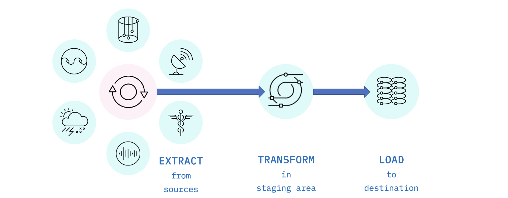  
- Transformations including:  
    - Cleaning: fixing any errors or missing values  
    - Filtering: selecting only what is needed  
    - Joining: merging disparate data sources  
    - Normalizing: converting data to common units  
    - Data Structuring: converting one data format to another, such as JSON, XML, or CSV to database tables 
    - Feature Engineering: creating KPIs for dashboards or machine learning   
    - Anonymizing and Encrypting: ensuring privacy and security 
    - Sorting: ordering the data to **improve search performance**  
    - Aggregating: summarizing granular data  
- ETL to Postgres example:  
```
# cp-access-log.sh
# This script downloads the file 'web-server-access-log.txt.gz'
# from "https://cf-courses-data.s3.us.cloud-object-storage.appdomain.cloud/IBM-DB0250EN-SkillsNetwork/labs/Bash%20Scripting/ETL%20using%20shell%20scripting/".

# The script then extracts the .txt file using gunzip.

# The .txt file contains the timestamp, latitude, longitude 
# and visitor id apart from other data.

# Transforms the text delimeter from "#" to "," and saves to a csv file.
# Loads the data from the CSV file into the table 'access_log' in PostgreSQL database.
# Download the access log file

wget "https://cf-courses-data.s3.us.cloud-object-storage.appdomain.cloud/IBM-DB0250EN-SkillsNetwork/labs/Bash%20Scripting/ETL%20using%20shell%20scripting/web-server-access-log.txt.gz"
# Unzip the file to extract the .txt file.
gunzip -f web-server-access-log.txt.gz

# Extract phase

echo "Extracting data"

# Extract the columns 1 (timestamp), 2 (latitude), 3 (longitude) and 
# 4 (visitorid)

cut -d"#" -f1-4 web-server-access-log.txt > extracted-data.txt

# Transform phase
echo "Transforming data"

# read the extracted data and replace the colons with commas.
tr "#" "," < extracted-data.txt > transformed-data.csv

# Load phase
echo "Loading data"

# Send the instructions to connect to 'template1' and
# copy the file to the table 'access_log' through command pipeline.

echo "\c template1;\COPY access_log  FROM '/home/project/transformed-data.csv' DELIMITERS ',' CSV HEADER;" | psql --username=postgres --host=localhost
```  
## Pipeline  
- Data Pipeline Performance  
    - Latency: the total time it takes for a single packet of data to pass through the pipeline.  
    - Throughput: how much data can be fed through the pipeline per unit of time.  
- Data Pipeline Processes  
    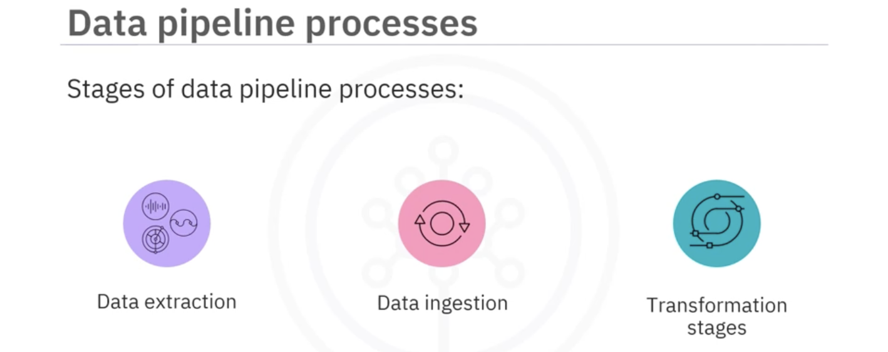  
    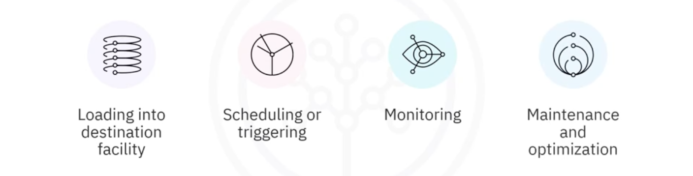  
- Pipeline Monitoring Cosiderations  
    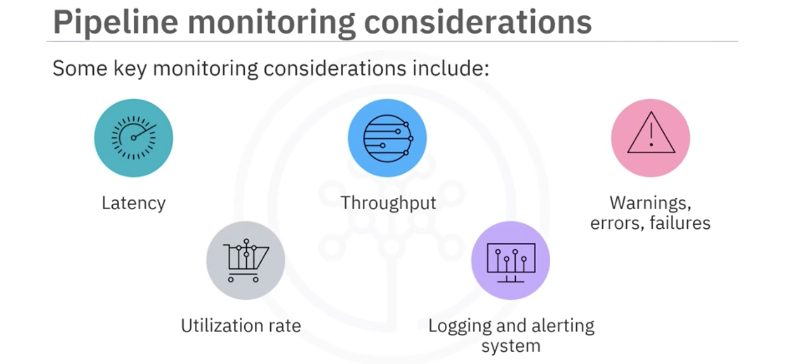  
## Airflow  
- Architecture  
    - Simplified view  
    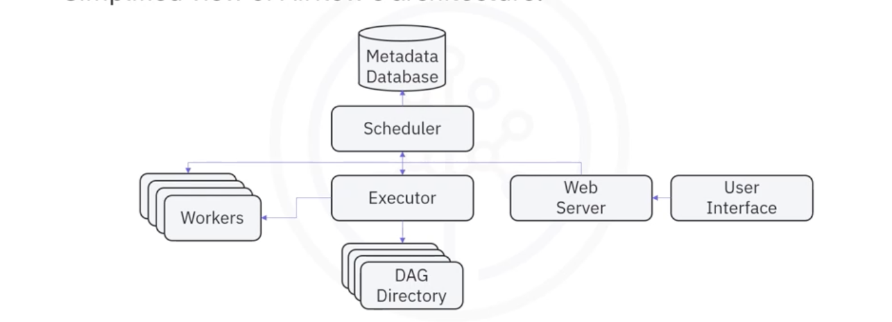  
    - Task state  
    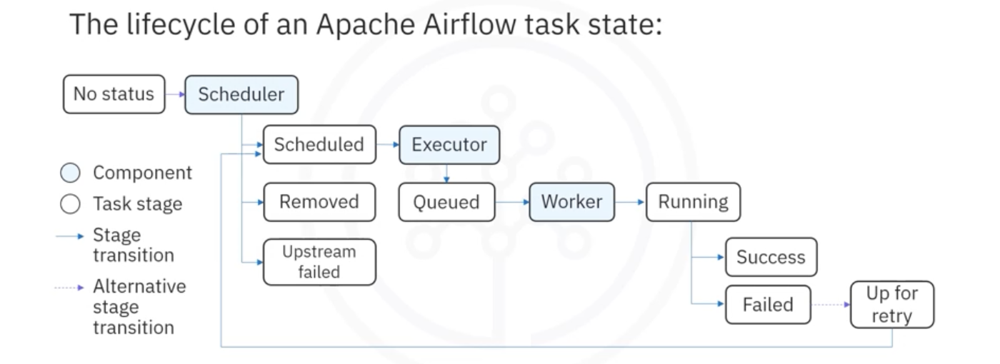  
- DAG
    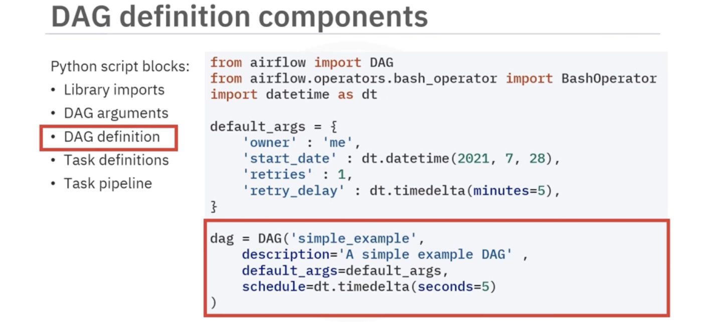  
    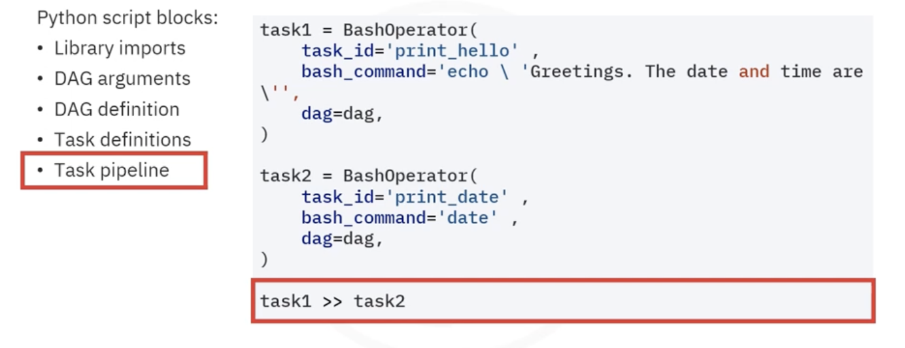  
- CLI  
    - ```airflow dags list``` - list all the existing DAGs  
    - ```airflow tasks list example_bash_operator``` - list all tasks in the DAG named `example_bash_operator`  
    - ```airflow dags unpause tutorial``` - unpause a DAG named `tutorial`  
    - ```airflow dags pause tutorial``` - pause the DAG  
- Logs and Monitoring  
    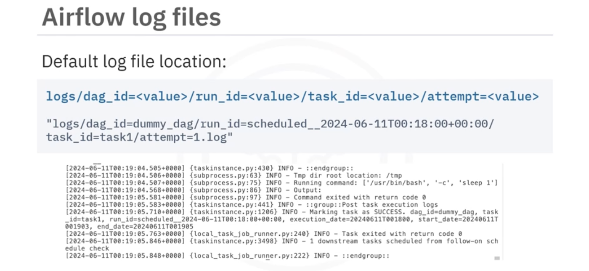  
    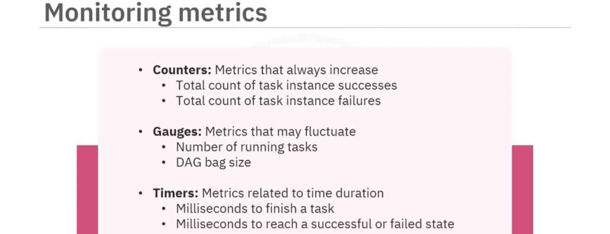  
    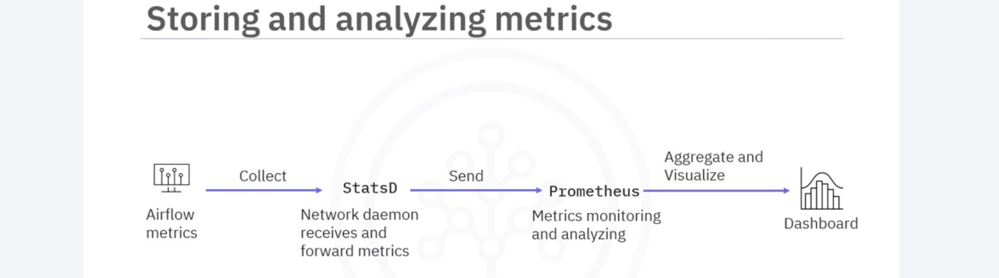  
## Kafka  
- Distributed Event Streaming Platform 
    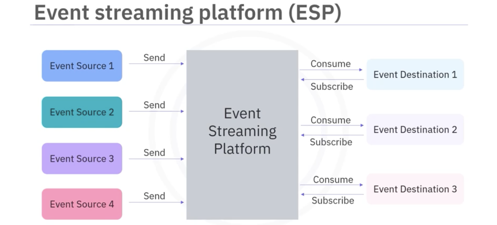  
    - Components  
        - Event Broker  
            - Ingester  
            - Processor  
            - Consumption  
        - Event Storage  
        - Analytic and Query Engine  
- Kafka Components  
    - Brokers: the dedicated servers to receive, store, process, and distribute events.  
    - Topics: the containers or databases of events.  
    - Partitions: divide topics into different brokers.  
    - Replications: duplicate partitions into different brokers.  
    - Producers: Kafka client applications that publish events into topics.  
    - Consumers: Kafka client applications that subscribe to topics and read events from them.  
- Architecture  
    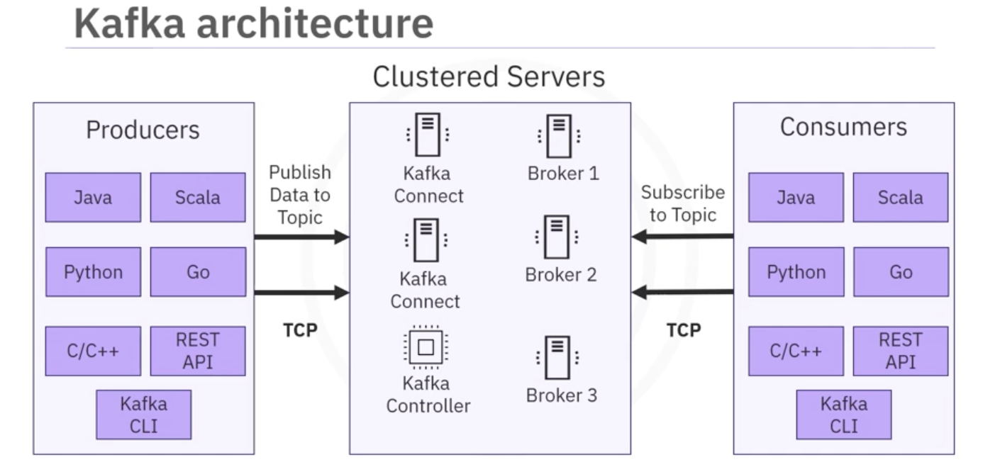  
- CLI  
    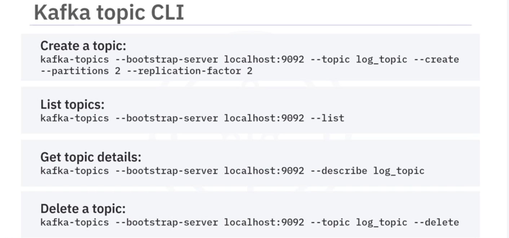  
    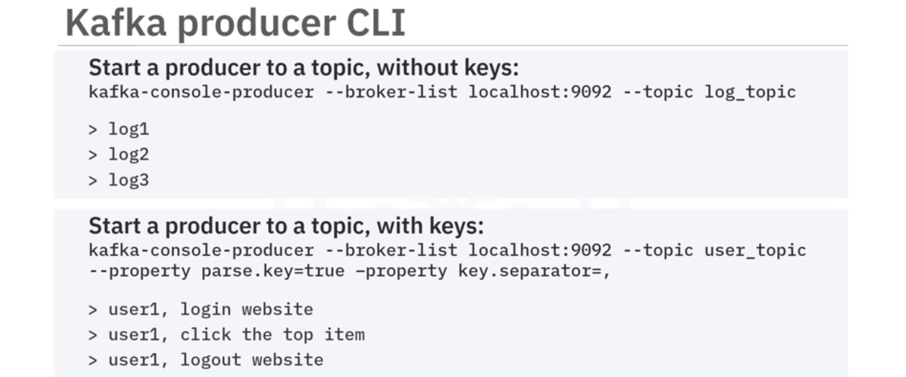  
    > In the back end, messages with the same key are published into the same partition and will always be consumed by the same consumer. As such, the original publication order is kept on the consumer side.  

    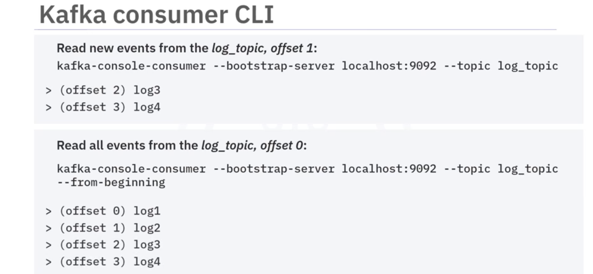  
    > Message `offset` indicates a message's position in the sequence.  
    > `lag` represents the number of unconsumed messages for each partition.  
- Python  
    - ```pip3 install kafka-python```  
    - ```admin_client = KafkaAdminClient(bootstrap_servers="localhost:9092", client_id='test')```  
    - create topic:  
        - ```topic_list = []```
        - ```new_topic = NewTopic(name="bankbranch", num_partitions= 2, replication_factor=1)```  
        - ```topic_list.append(new_topic)```  
        - ```admin_client.create_topics(new_topics=topic_list)```  
    - describe a topic: ```configs = admin_client.describe_configs(config_resources=[ConfigResource(ConfigResourceType.TOPIC, "bankbranch")])```  
    - create a priducer:  
        - ```producer = KafkaProducer(value_serializer=lambda v: json.dumps(v).encode('utf-8'))```  
        - ```producer.send("bankbranch", {'atmid':1, 'transid':100})```
        - ```producer.flush()```  
        - ```producer.close()```  
    - create a consumer:  
        - ```consumer = KafkaConsumer('bankbranch', group_id=None, bootstrap_servers=['localhost:9092'], auto_offset_reset = 'earliest')```  
        - ```for msg in consumer: print(msg.value.decode("utf-8"))```  
    