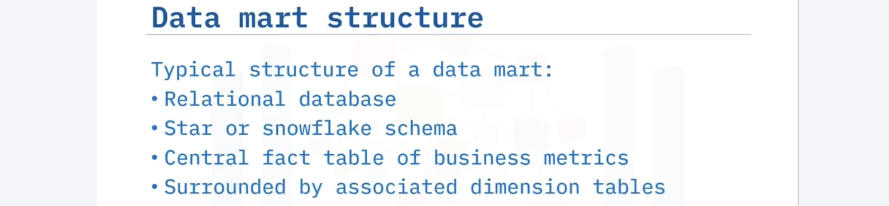
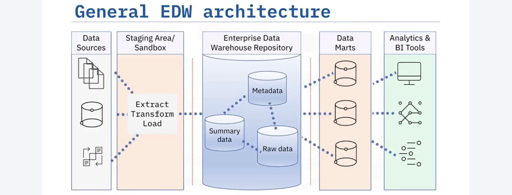
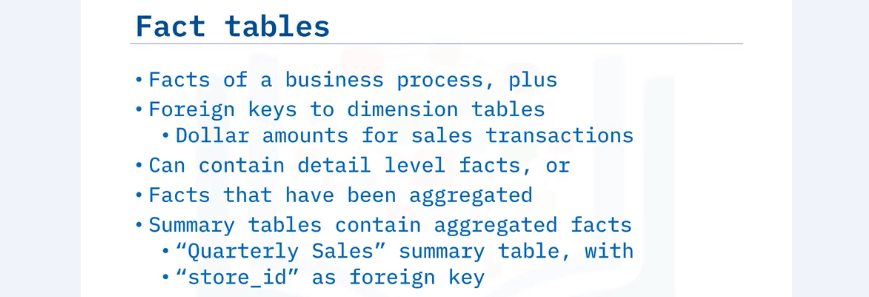
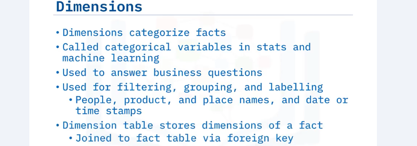
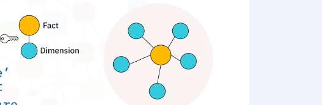
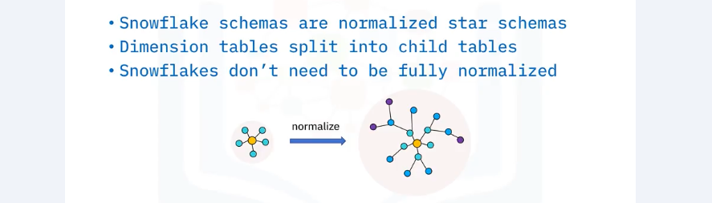
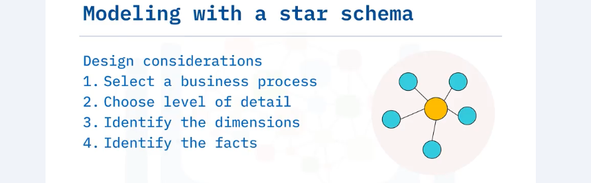
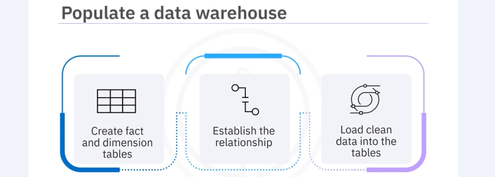

# Data Warehouse Fundamentals  
## Data Repository   
- A **data warehouse** is a system that aggregates data from one or more sources into a single, central, consistent data store to support various data analytics requirements.  
- A **data mart** is an isolated part of the larger enterprise data warehouse that is specifically built to serve a particular business function, purpose, or community of users.  
    - Data marts are designed to provide specific support for making tactical decisions. As such, data marts are focused only on the most relevant data, which saves end users the time and effort that would otherwise be spent searching the data warehouse for insights.  
      
- A **data lake** is a storage repository that can store large amounts of structured, semi-structured, and unstructured data in their native format, classified and tagged with metadata.  
    - Data lakes are sometimes also used as a staging area for transforming data prior to loading into a data warehouse or a data mart.  
- **Data Lakehouse** architecture uniquely combines the scalability and flexibility of data lakes with the management features and performance of data warehouses. This architecture allows organizations to store all their data in a single, unified repository that supports both machine learning and BI workloads effectively.  
## Data Warehouse   
- Architecture  
  
- Facts and Dimensional Modeling  
    - Business data can be classified into 2 categories: facts and dimensions.  
    - Facts: represent numerical measures of business processes.  
    - Dimensions: categorize facts.  
    - Facts and dimensions are linked using foreign-primary keys  
      
      
- Star and SnowFlake Schema  
    - Star: Keys connect Facts with Dimensions  
      
    - Snowflake: 
      
    > Normalization reduces redundancy  

    - Modeling  
      
- Data Quality Verification  
    - Accuracy  
    - Completeness  
    - Consistency  
    - Currency  
- Populate  
      
