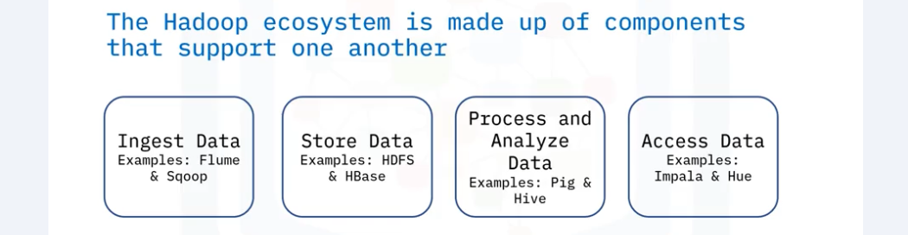
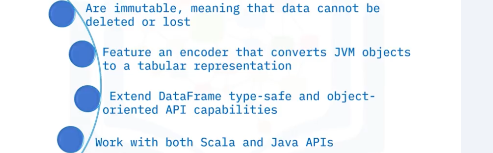
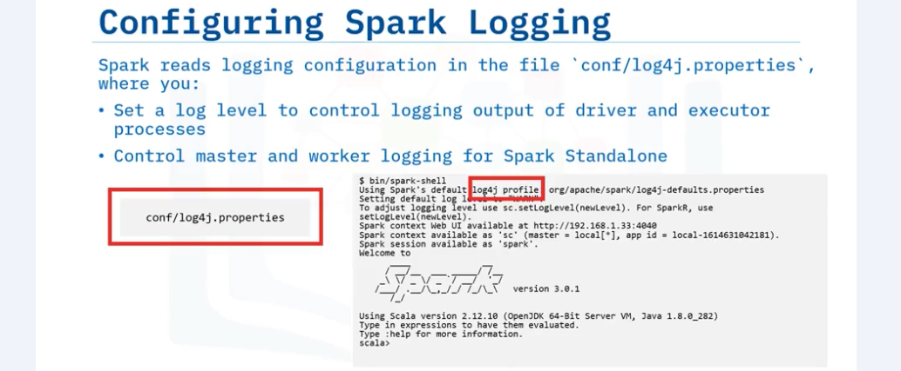
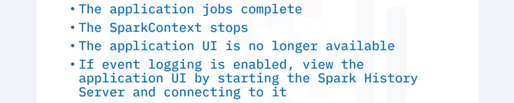
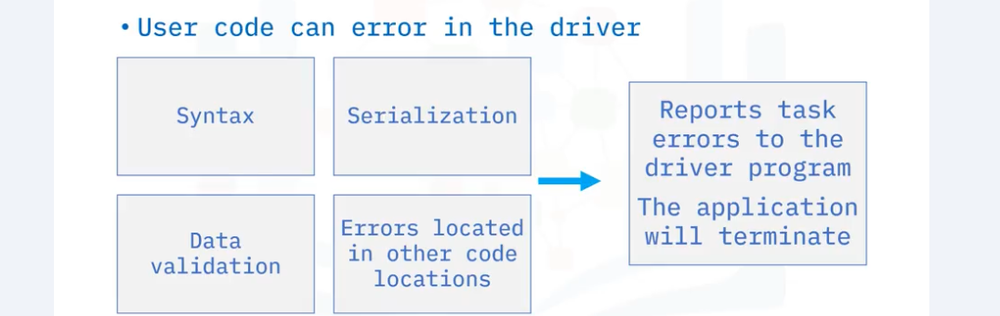

# Introduction to Big Data with Spark and Hadoop  
## Hadoop  
- Components  
      
      
- Not fit for  
    
- MapReduce  
    - Map processes data into Key Value pairs, sorts and organizes the data.  
    - The Reducer aggregates and computes a set of results and produces a final output.  
      
- Ecosystem  
      
    - Ingest  
      
    - Store  
      
    - Analyze  
      
    - Access  
      
- HDFS  
    - Hadoop Distributed File System  
    - HDFS works by splitting the files into blocks, then creating replicas of the blocks, and storing them on different machines.  
    - Features  
      
    - Concepts  
        - Blocks  
              
        - Nodes : Primary Node/ Name Node, Secondary Node/ Data Node  
              
        - Rack  
              
            Replicas of a data node are in different racks. If a rack is down, data can still be obtained from another rack.  
        - Replication  
              
        - Read and Write  
              
    - Architecture  
          
- Hive  
    - Hive is a data warehouse software within Hadoop that is designed to read, write, and manage large and tabular-type datasets and data analysis.  
    - Compare  
      
    - Architecture  
      
- HBase  
    - HBase is a column-oriented non-relational database management system that runs on top of HDFS.  
    - It provides a fault-tolerant way of storing sparse data sets.  
    - Features  
      
      
    - Compare  
      
    - Architecture  
      
    - Components  
      
## Spark  
- Spark is an open-source, in-memory application framework for distributed data processing and iterative analysis on massive data volumes. 
- **Resilient Distributed Datasets (RDDs)**  
      
      
    - Transformations  
          
        - two types of transformations:
            1. Narrow transformations in Spark work within partitions without shuffling data between them. They're applied locally to each partition, avoiding data exchange.  
            2. Wide transformations in Spark involve redistributing and shuffling data between partitions, often leading to more resource-intensive and complex operations.  
    - Actions  
          
    - DAG: Directed Acyclic Graph  
          
- Every Spark application consists of a driver program that runs the user's main functions and runs multiple parallel operations on a cluster.  
- Components  
  
- Spark Core  
  
- Architecture  
      

- Declarative programming: A programming paradigm that a programmer uses to define the program's accomplishment without defining how it needs to be implemented. The approach primarily focuses on what needs to be achieved, rather than advocating how to achieve it.  
- UDF in PySpark  
> [CSDN Blog: PySpark](https://blog.csdn.net/m0_46454544/article/details/127158431)  

  
  
------
  
- User-Defined Schema in PySpark    
    1. Import the required libraries.  
    ```
    from pyspark.sql.types import StructType, IntegerType, FloatType, StringType, StructField
    ```  
    2. Define the schema.  
    ```
    schema = StructType([
        StructField("Emp_Id", StringType(), False),
        StructField("Emp_Name", StringType(), False),
        StructField("Department", StringType(), False),
        StructField("Salary", IntegerType(), False),
        StructField("Phone", IntegerType(), True),
    ])
    ```  
    3. Read the input file with user-defined schema.  
    ```
    #create a dataframe on top a csv file
    df = (spark.read
    .format("csv")
    .schema(schema)
    .option("header", "true")
    .load("employee.csv")
    )

    # display the dataframe content
    df.show()
    # display the schema of a DataFrame
    df.printSchema()
    ```  
- **Datasets**  
    - The newest Spark data abstraction, like RDDs and DataFrames, provide APIs to access a distributed data collection.  
    - provides the combined benefits of both RDDs and SparkSQL.   
    - A dataset is a distributed collection of strongly typed JVM objects.  
    - Features  
      
    - Benefits  
      
    - Compare  
      
- Spark SQL Optimization  
    - Catalyst: rule-based optimizer  
      
    - Tungsten: cost-based optimizer  
      
## Spark Architecture & Runtime Environment  
- Architecture
    - Application Process  
          
    - Spark Context
        - The driver creates jobs, and the Spark Context splits jobs into tasks that can be run in parallel in the executors on the cluster.  
          
    - Jobs  
          
    - Tasks  
          
    - Executers  
          
    - Stages and Shuffles  
          
          
    - Driver Deploy Modes  
          
- Cluster Modes  
    - Spark Cluster Manager  
          
        - While an application is running, the Spark Context creates tasks and communicates to the cluster manager what resources are needed. Then the cluster manager reserves executor cores and memory resources. Once the resources are reserved, tasks can be transferred to the executor processes to run.  
        - Spark Cluster Manager Types  
              
            1. Spark Standalone  
              
              
            2. YARN  
              
              
            3. Mesos  
                - Apache Mesos Cluster Managers can run Spark with other benefits, such as making partitioning: 1. Scalable between many Spark instances, 2 Dynamic between Spark and other big data frameworks.  
            4. Kubernetes  
              
              
    - Local Mode  
      
      
- Run Spark Application  
    - Spark Submit  
      
      
      
    - Application Dependencies  
          
          
        > Java Archive (JAR): A standard file format used to package Java classes and related resources into a single compressed file. JAR files are commonly used to bundle Java libraries, classes, and other assets into a single unit for distribution and deployment.  
        > Uber-JAR: An Uber-JAR is a single Java Archive (JAR) file that contains not only the application code but also all its dependencies, including transitive ones. The purpose of an Uber-JAR is to create a self-contained package that can be easily transported and executed within a computing cluster or environment.

    - Spark Shell
      
      
    - Example  
        1. download the Spark environment (Prerequisite: install Java. Hadoop is not necessary fot local development)  
        > [Official Spark website](https://spark.apache.org/downloads.html)  

        ``` 
        wget https://archive.apache.org/dist/spark/spark-3.3.3/spark-3.3.3-bin-hadoop3.tgz && tar xf spark-3.3.3-bin-hadoop3.tgz && rm -rf spark-3.3.3-bin-hadoop3.tgz 
        ```  
        2. set up environment variables `JAVA_HOME` and `SPARK_HOME`  
        ```
        export JAVA_HOME=/usr/lib/jvm/java-1.11.0-openjdk-amd64
        export SPARK_HOME=/home/project/spark-3.3.3-bin-hadoop3
        ```
        3. create a config file for the master  
        ``` 
        touch /home/project/spark-3.3.3-bin-hadoop3/conf/spark-defaults.conf 
        ```
        4. edit `spark-defaults.conf` file
        ```
        spark.executor.memory 4g
        spark.executor.cores 2
        ```
        5. run the Spark master  
        ```
        cd $SPARK_HOME
        ./sbin/start-master.sh
        ```
        6. run the Spark worker  
        ```
        ./sbin/start-worker.sh spark://theiadocker-yourname:7077 --cores 1 --memory 1g
        ```  
        7. edit Python script file  
        ```
        ... 
        spark = SparkSession.builder \
        .master('spark://theiadocker-u1529230703:7077') \
        .config() 
        ... 
        ```
        8. execute Python script  
        ```
        python3 submit.py
        ```
        9. monitoring: Spark provides a web-based interface (by default at http://localhost:4040) to monitor your Spark applications and their progress.  
        10. clean up: Make sure to stop the Spark session after you're done releasing resources.  
        ```
        spark.stop() 
        ```
- Configuration  
    - Types 
      
     
    1. Properties 
        - Set Properties  
          
        - Precedence  
          
    2. Environment Variables  
      
    3. Logging  
      
      
# Monitoring  
- Spark UI  
    - The SparkContext starts a web server for the application UI.  
    - URL: `http://<driver-node>:4040`
      
    - Workflow  
      
    - History Server  
      
      
- Debugging Issues  
    - Common application issues:
        1. user code  
            - User code is made up of the driver program, which runs in the driver process, and the functions and variables serialized that the executor runs in parallel. The driver and executor processes run the application user code of an application passed to the Spark-submit script. The user code in the driver creates the SparkContext and creates jobs based on operations for the DataFrames. These DataFrame operations become serialized closures sent throughout the cluster and run on executor processes as tasks. The serialized closures contain the necessary functions, classes, and variables to run each task.
              
        2. system and application configurations  
        3. missing application dependencies  
              
        4. improper resource allocation  
            - CPU cores and memory can become an issue if a task is in the scheduling queue and the available workers do not have enough resources to run the tasks. As a worker finishes a task, the CPU and memory are freed, allowing the scheduling of another task. However, if the application asks for more resources that can ever become available, the tasks might never be run and eventually time out. Similarly, suppose that the executors are running long tasks that never finish. In that case, their resources never become available, which also causes future tasks to never run, resulting in a timeout error. Users can readily access these errors when they view the UI or event logs.  
        5. network communications  
    - Log Files  
      
- Memory Resources  
    - Memory Setting Considerations  
          
    - Spark Unified Memory  
        - executor memory and storage memory share a unified region. If executor memory is not used, storage can acquire all the available memory and vice versa.  
        - executor memory can evict storage memory if necessary, only until total storage memory usage falls under a certain threshold. R represents a subregion within M that cached blocks are never evicted.  
        - storage is not allowed to evict executor memory due to complexities in implementation.  
          
    - Spark Data Persistence (caching data)  
        - Once intermediate data is computed to generate a fresh DataFrame and cached in memory, subsequent operations on the DataFrame can utilize the cached data instead of reloading it from the source and redoing previous computations.  
        - This feature is crucial for accelerating machine learning tasks that involve multiple iterations on the same data set during model training.  
        - Example  
              
            - only needs to generate random features once.  
            - If this DataFrame is not cached, then different random features would be generated with each action on the DataFrame, because the function `rand()` is called each time.  
- Processor Resources  
      
    - If the executor does not have the required number of cores available, tasks do not start until the specified number of cores are free or another executor becomes available.  


