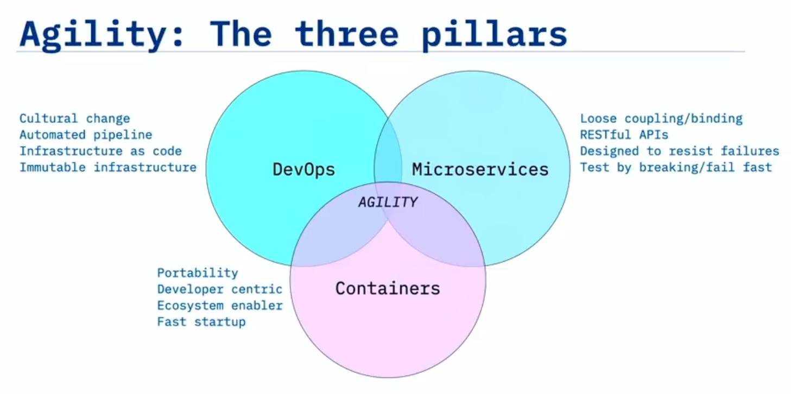
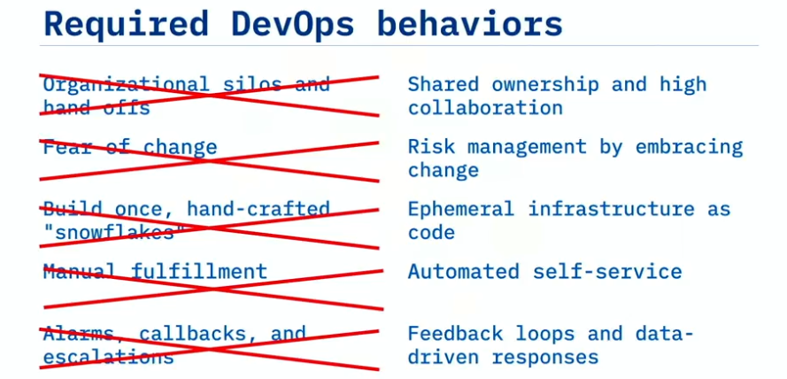
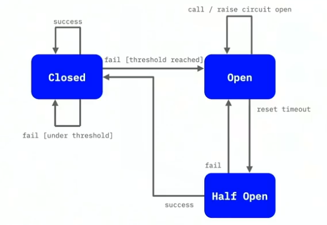
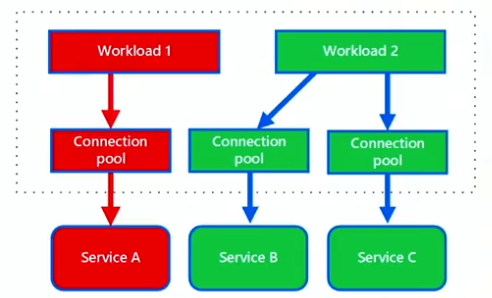
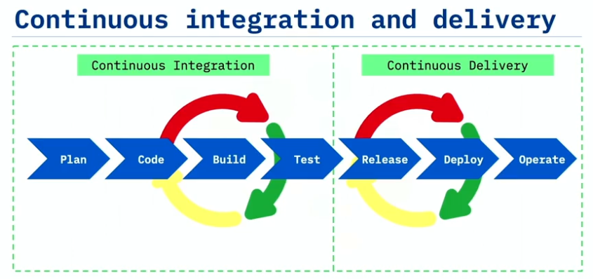
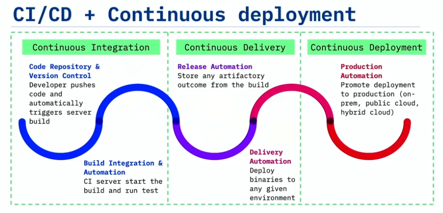
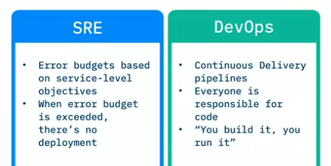

# Introduction to DevOps
## Definition 
- DevOps is a cultural change (or practice) in which development and operations engineers work together during the entire software lifecycle, following Lean and Agile principles that allow them to diliver high-quality results.  
- Dev wants innovation, while Ops wants stability.  
- Essential characteristics  

- Three dimensions
    - Culture 
    - Method 
    - Tools 
- Required DevOps behaviors  

## Cloud Native 
- Cloud Native architecture is a collection of independently deployable microservices.
- Stateless microservices each maintain their own state in a separate database or persistent object store.
- Microservices are loosely coupled services, designed for scalability and communication with APIs.
## Designs for failure
1. **Retry pattern** - retry failed operations  
  
2. **Circuit breaker pattern** - avoid cascading failures  
  
3. **Bulkhead pattern** - isolate failing services  
  
## CI/CD
- **Continuous Integration** is building, testing, and **integrating every change into the master branch** after tests has passed.  
- **Continuous Delivery** ensures that code can be rapidly and safely deployed to production by **delivering every change to a production-like environment**.  
- Benefits: faster reaction time, reducing the risk of integrating code, and moving faster 
- Pipeline:   
  
- Principals  
    1. Build quality in  
    2. Work in **small batches**  
    3. Computer perform repetitive tasks, people solve problems  
    4. Relentlessly pursue continuous improvement  
    5. Everyone is responsible / shared responsibility  
- **Continuous Deployment**  
  
## Orgnization  
- Conway's law: a company's design results are a direct reflection of the company's communication structure.  
- Successful DevOps teams should be organized around buziness domains. Each team should have a mission that aligns with a business domain.  
## Metrics  
- ~~Vanity metrcis (provide no insights)~~ Actionable Metrcis: 
    1. Mean Lead Time  
    2. Release frequency  
    3. Change failure rate  
    4. Mean time to recover (MTTR)  
## SRE
- the comparison of approaches to maintain stability between SRE(Site Reliability Engineer) and DevOps  
  
