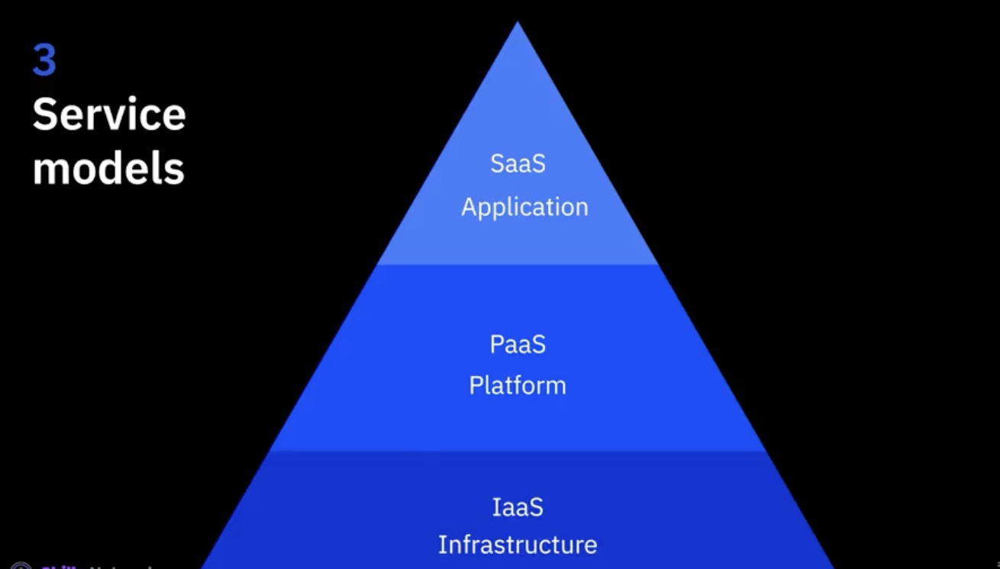
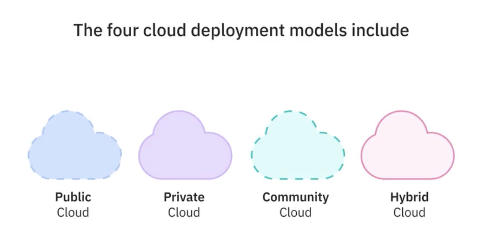
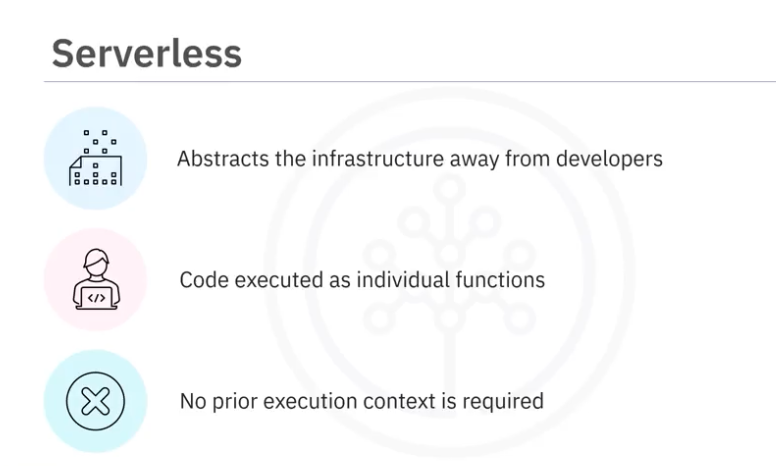
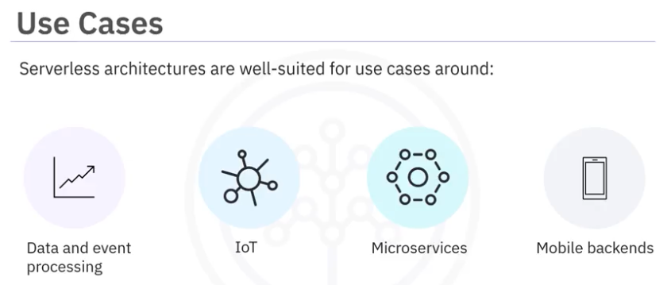
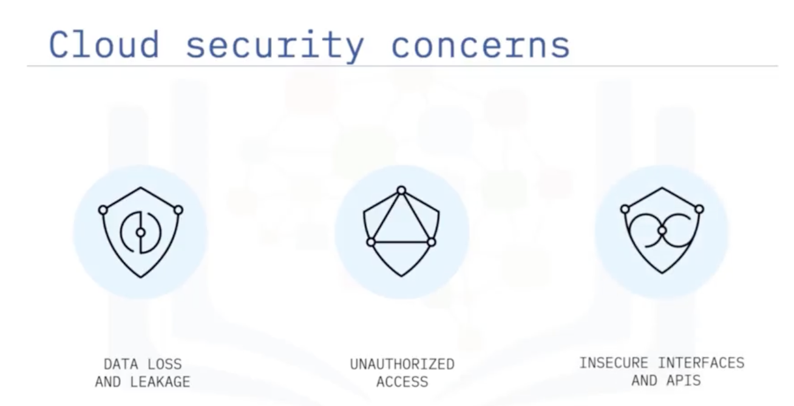
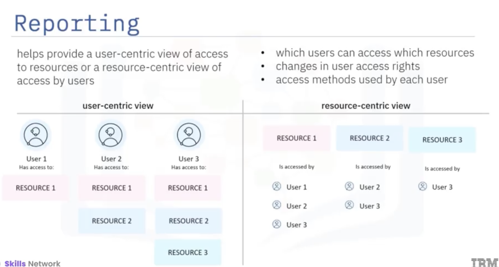
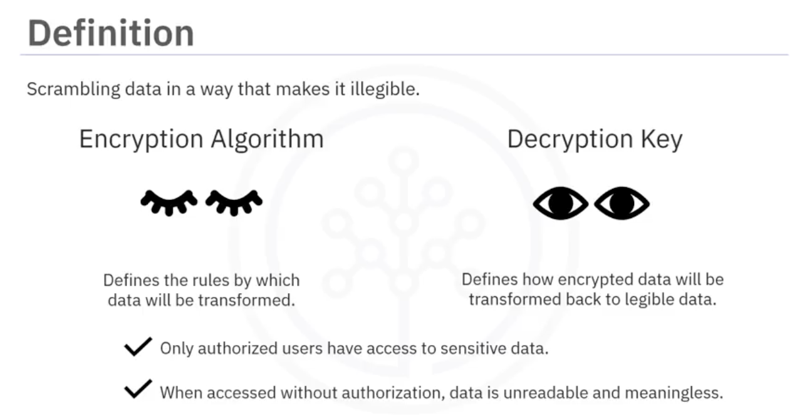
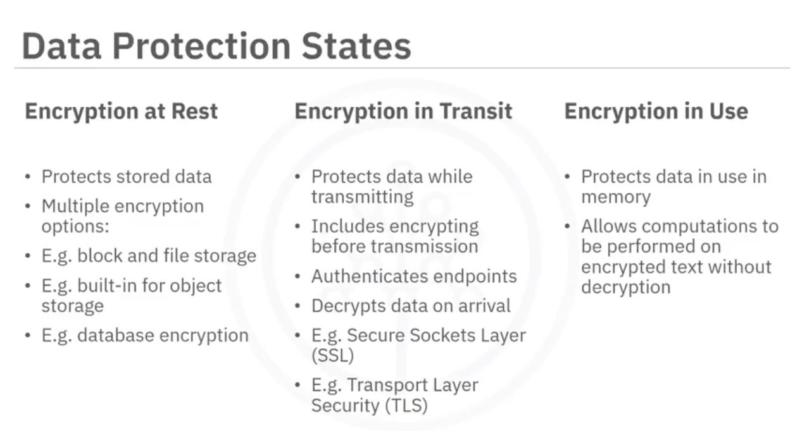
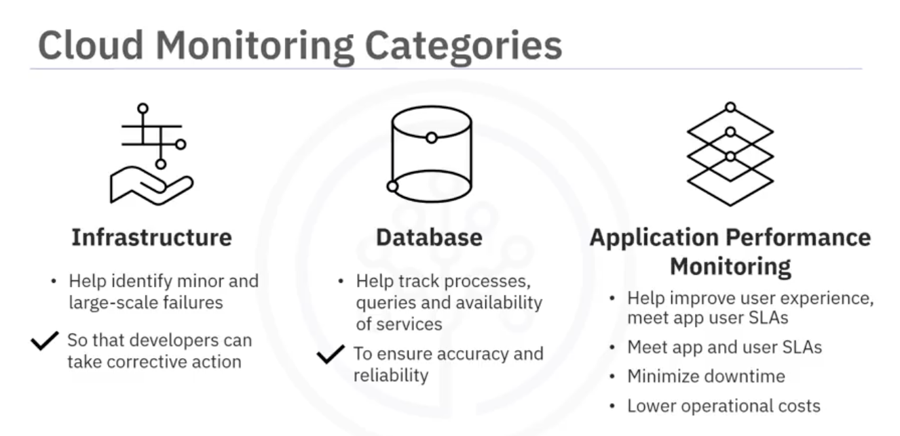

# Introduction to Cloud Computing  
## Definition  
- Cloud Computing: Model for enabling convenient, on-demand network access to a shared pool of configurable computing resources.  
- Resources: Networks, Servers, Storage, Applications, Services  
- 5 Essential Characterastics  
    - on demand self service  
    - broad network access  
    - resource pooling  
    - rapid elasticity  
    - measured service  
## Models  
- Service Models  
  
- Deployment Models  
  
## Infrastructure & Components
- Types of **Virtual Machines**  
    - Shared/Public Cloud VMs  
    - Transient/Spot VMs  
    - Reserved virtual server instances  
    - Dedicated Hosts  
- **Bare Metal servers** are suitable for  
    - high-performance computing(HPC) and data-intense applications  
    - high degree of scurity or compliance requirements  
- **Containers**  
    - An executable unit of software in which application code is packaged, along with its libraries and dependencies, in common ways so that it can be run anywhere (Desktop, Traditional IT, Cloud).  
    - Small, Fast, Portable  
- **Cloud Storage**  
    1. Direct Attached Storage / Local Storage: within the same rack, use for OS.  
    2. File Storage / NFS(Network Attached Storage) Storage: hierarchical structure, mounted to compute nodes via ethernet network.  
    3. Block Storage: fast read/write speed, more secure, extremely resilient to failure, attached using fibers and to solely one node at a time.  
        > - IOPS(Input/Output Operations Per Second): The speed at which the disk can write and read data.  
        > - A way to backup File and Block Storage: Snapshot Image of storage at a particular instant.  
    4. Object Storage: not attached to compute node, accessed via an API, cheap, has different tiers based on access frequency.  
- **CDN (Content Delivery Network)**: a distributed server network that delivers temporarily stored, or cached, copies of website content to users, based on the user's geographic location.
- **Microservices** : Microservices architecture is an approach in which a single application is composed of many loosely coupled and independently deployable smaller components or services.  
    - have their own stack running on their own containers.  
    - communicate with one another over a combination of APIs, event streaming and message brokers.  
- **Serverless** is an approach to computing that offloads responsibility for common infrastructure management tasks, such as **scaling**, **scheduling**, **patching** and **provisioning** application stacks to cloud providers, allowing developers to focus their time and effort on the code and business logic specific to their applications or process.  
   
   
## Security 
  
- IAM(Identity and Access Management): first line of defense, authenticate and authorize users, provide user-specific access.  
  
- Encryption: last line of defense.  
  
  
- **Cloud Monitoring** solutions assess data, application and infrastructure behavior for: performance, resource allocation, network availability, compliance and security risks and threats.  
  
- Cloud environments are susceptible to various **attacks** and **vulnerabilities**.  
    - Distributed Denial of Service (DDoS) Attacks: DDoS attacks aim to overwhelm cloud resources by flooding them with excessive traffic, leading to service disruptions.  
    - Data Breaches: Data breaches pose a significant risk in cloud environments, as they can result in unauthorized access to sensitive data stored in the cloud.  
    - Misconfigurations: Misconfigurations in cloud services can lead to security vulnerabilities and expose sensitive data to unauthorized access. For example, misconfigured access control policies or open storage buckets can provide unintended access to data.  
    - Insider Threats: Insider threats involve unauthorized or malicious actions by individuals with legitimate access to cloud resources. These individuals may intentionally abuse their privileges or inadvertently cause security incidents.  
