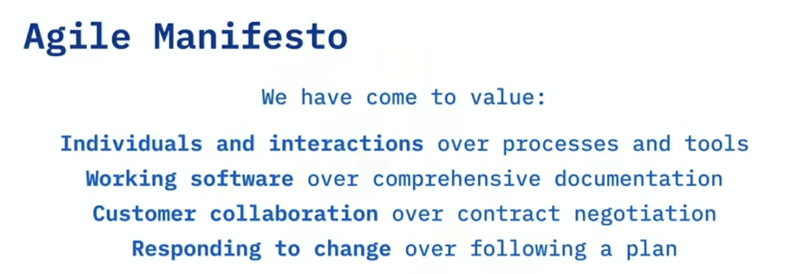
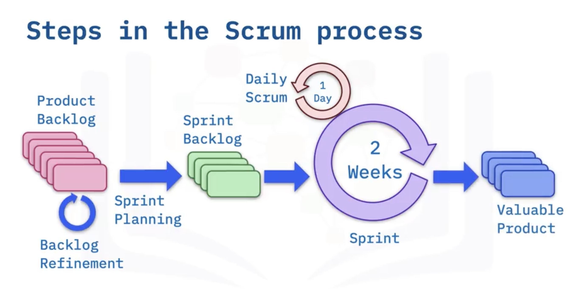
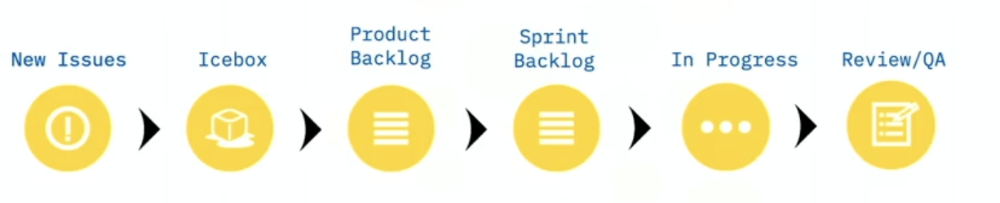

# 03 Introduction to Agile Development and Scrum  
## Agile  
- Definition: Agile is a iterative approach to project management that helps teams be responsive and deliver value to their customer faster.  
    - Adaptive planning  
    - Evolutionary development  
    - Early delivery  
    - Continual improvement  
    - Responsiveness to change  

  
## Scrum  
> Agile is a philosophy. Scrum is a methodology.  

  
- 3 Roles  
    - **Product Owner** represents stakeholders, articulates the product vision and decides priorities, requirements and readiness to ship.  
    - **Scrum Master** coaches the team, promotes a cooperative environment, shields the team from the interference and unblock impediments.  
    - **Scrum Team** is small, dedicated, co-located, cross-functional, and self-managing. The scrum team negotiates commitments with the product owner - one sprint at a time. The scrum team has autonomy regarding how to reach commmitments.  
- **Kanban Borad** is a way of tracking plan items needing to be done, items in process, and completed items.  
      
- A **User story** represents a small piece of business value that a team can deliver in an interation. 
    - Well-formed user story will meet the criteria of (Bill Wake's INVEST): Independent, Negotiable, Valuable, Estimable, Small, Testable.  
    - Epic is a user story that is bigger than a single sprint.  
    1. Brief description of the need and business value  
        > As a \<some role\>  
        > I need \<some function\>  
        > So that \<some benefit\>  
    2. Any assumptions and details  
        > \<assumptions\>  
        > \<details\>  
    3. Acceptance Criteria / The definition of "done"  
        > (Gherkin Syntax)  
        > Given \<some precondition\>  
        > When \<some event happens\>  
        > Then \<some outcome\>  
    ```
    **As a** [role]  
    **I need** [function]  
    **So that** [benefit]  
    
    ### Details and Assumptions  
        * [document what you know]  
    
    ### Acceptance Criteria  
        gherkin  
        Given [some context]  
        When [certain action is taken]  
        Then [the outcome of action is observed]  
    ```  
- **Technical debt** is any story that does not add perceived value to the stakeholder. Examples:  
    - Code refactoring  
    - Setup and maintenance of environments  
    - Changing technology like databases  
    - Updating Vulnerable libraries  
