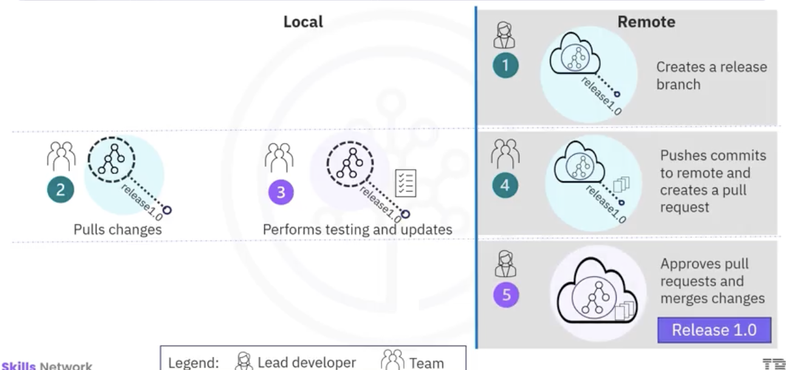

# Getting Started with Git and Github  
## Git Workflow  
  
  
  
## Git Commands
- ```git init``` initiate  
- ```git add``` move changes from working repository to staging area  
- ```git commit -m "some description"``` commit changes to the project  
- ```git log``` browse the previous changes  
- ```git status```  see status of  working repository  
- ```git branch``` list existing branches; create a new branch; delete a branch (`git branch -d xxx`)
- ```git checkout``` switch to a branch  
- ```git merge``` merges the feature branch to the main branch (need to switch to the main branch frist)  
- ```git push -u origin main``` push the main branch to remote repository  
- ```git revert HEAD --no-edit``` rollback the last commit  
-   
## Clone & Fork  
- Fork: Takes a copy of GitHub repository to use it as the base for a new project.  
    - Submit changes back to the original repository, the owner decides whether to accept updates.  
    - Keep a copy of license file.  
- **Fork Workflow**  
  
  


