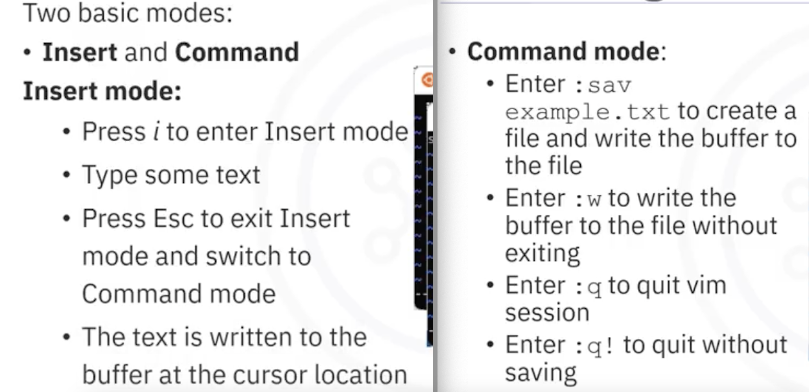
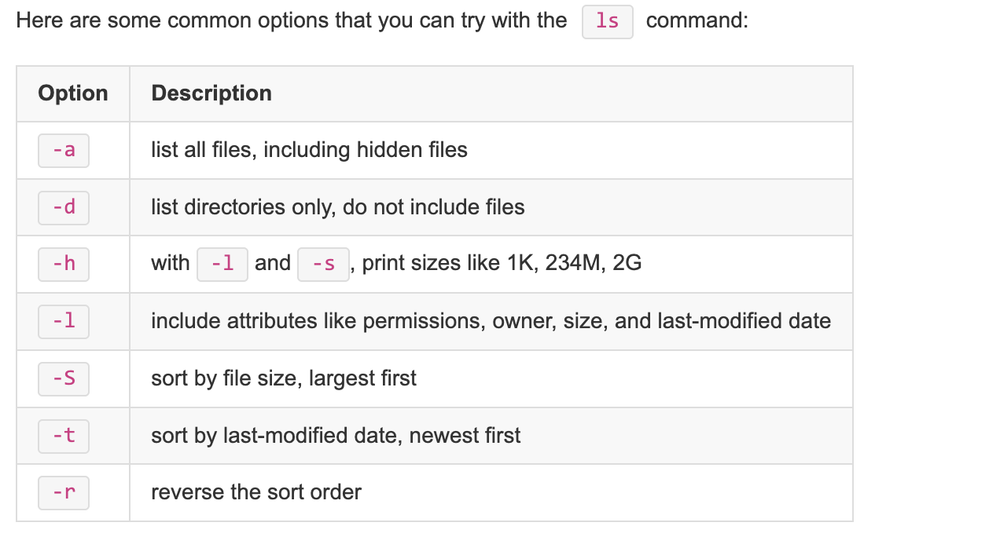
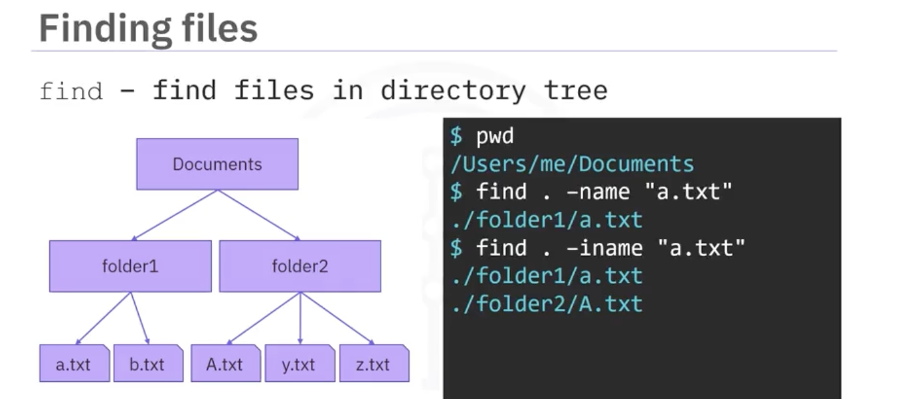
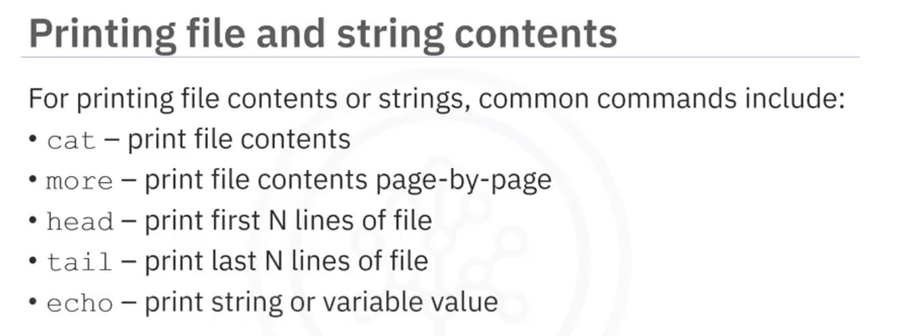
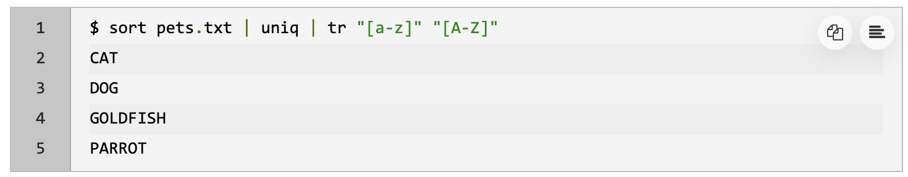

# Hands-on Introduction to Linux Commands and Shell Scripting  
## Linux  
- Operating System (OS): is a software that manages hardware and resources, and allows interaction with hardware to perform useful tasks.  
- **Architecture**  
      
    - UI (User Interface): Allow users to interact with the machine.  
    - Applications: Softwares that let you perform a task. System tools, Programming languages, Shells, User apps.  
    - Operating System: Controls the jobs and programs vital to health and stability.  
        - Assigns software to users.  
        - Helps detect errors and prevent failures.  
        - Performs file management tasks.  
    - Kernel: lowest-level of software, starts on boot, perform vital operations, bridge between apps and hardware. Key jobs:  
        - Memory management  
        - Process management  
        - Device drivers  
        - Security  
    - Hardware: all physical and electronic devices. CPU, RAM, Storage, Screen, USB devices ...  
- **Shell**: an OS-level application that interprets commands.  
    - Terminal: an application used to interact with shell.  
      
- **File editing with Vim**  
      
    > [Runoob Linux Vim](https://www.runoob.com/linux/linux-vim.html)  
    >   
- Pakages  
      
      
## Commands  
> [WikiPedia of Unix command](https://en.wikipedia.org/wiki/List_of_POSIX_commands)  

  
`tldr` - similar to `man` but not verbose  
`date -r myfile.txt` - to verify the change date of a file  
      
  
      
      
  
      
    `-R` - recursively list all files and folders  
      
  
      
      
      
      
      
      
      
      
  
`tar -cf xxx.tar folder` - archive  
`tar -tf xxx.tar` - list archive contents  
`tar -xf xxx.tar folder` - extract  
`tar -czf xxx.tar.gz folder` - archive and compress  
`tar -xzf xxx.tar.gz folder` - decompress and extract  
      
    `unzip -l xxx.zip` - list files of the zip archive  
      
  
> `sudo apt update`  
> `sudo apt install iproute2`  

`ip a` - display system network interfaces  
`ip addr show eth0` - display details for a specific device (eth0)  
>
    >   
    >   
    >   

## Shell Scripting  
- Shebang  
  
  
- Variable  
      
    - no spaces around "="  

      
    - `unset var_name` - deletes a variable   
    - `export var_name` - extends a variable to an environment variable  
    - `set` - list all shell variables  
    - `env` - list all environment variables  
- Pipes  
      
      
      
      
      
- Script Quoting  
      
- I/O Redirection  
      
- Command Substitution  
      
- Execution Modes  
      
- Bash Scripting  
    - Conditionals  
      
      
      
    - Arithmetic calculations  
      
    - Arrays  
    `my_array=(1 2 "three" "four" 5)` - create an array  
    `declare -a empty_array` - create an empty array  
    `my_array+=("six")`  `my_array+=(7)` - add items to an array  
      
    - For Loop  
          
        - sum up an array's elements  

          
- Job Scheduling  
          
    - minute, hour, day of month, month, and day of week  

      
    - append the current date to the file ‘sundays.txt’ at 15:30 every Sunday  

    `crontab -l` - list all cron jobs  
    `crontab -r` - remove all cron jobs  
