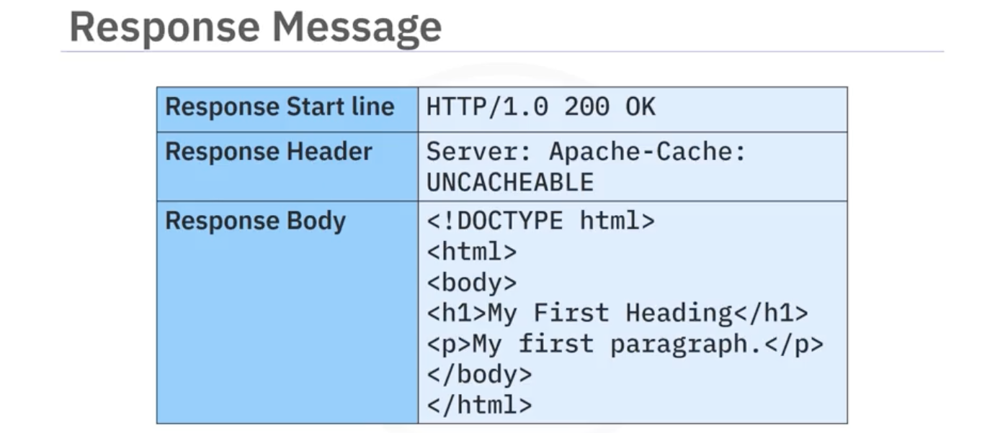

# Python for Data Science, AI & Development  
## API  
- REST APIs: REpresentational State Transfer APIs  
    > URL: Uniform Resource Locator  
    > Idempotent: Describes an element of a set that remains unchanged when making multiple identical requests. PUT and DELETE methods result in idempotent data if the same API method is called multiple times.

    - REST is a set of guidelines. There are five requirements for an API to be considered RESTful, plus one optional criterion:
        - The API leverages a client-server architecture made up of resources that are managed and delivered via HTTP.  
        - Communication between client and server is stateless.  
            - When the client makes a request, it also must pass information about its state to the server. Every communication between the client and server should contain all the information needed to perform the request. The client, not the service, maintains the state. Each request must contain the requisite information so the server understands the request. So, for example, if the user is viewing a database record and that record needs to be updated, the client must also send which record needs updating. The server doesn't know which record is currently being viewed.  
        - Data is cacheable to improve performance on the client side.  
        - The interface is transferred in a standard format such that the requested resources stored on the server are separated from the representation sent to the client. The representation sent to the client contains sufficient data so that the client can manipulate the representation.  
        - Requests and responses communicate through different layers, such as middleware. The client and server often do not communicate directly with each other.  
        - (Optional) Resources are usually static but can also contain executable code. The code should only be executed when the client requests it.  
    - REST APIs have the following characteristics:  
        - Resource-based; that is, they describe sets of resources  
        - Only contain nouns, not verbs  
        - Use singular nouns when referring to a singular resource or plural nouns when referring to a collection of resources  
        - Always identified by URLs  

        | NOT RESTful APIs | RESTful equivalents |
        | - | - |
        | GET http://api.myapp.com/getUser/123 | GET http://api.myapp.com/users/123 |
        | POST http://api.myapp.com/addUser | POST http://api.myapp.com/users |
        | GET http://api.myapp.com/removeUser/123 | DELETE http://api.myapp.com/users/123 |
    - URL format guidelines
        - Should use a slash '/' to denote a hierarchical relationship in the directory structure  
        - Should avoid using a trailing slash, e.g., /resource/  
        - Should use hyphens, not camel case, e.g., /my-resource, not /myResource  
        - Should not use an underscore '_' in the URL, e.g., /my-resource, not /my_resource  
        - Should use lowercase  
        - Should not use a period '.' in a URL  
        - May contain multiple subordinate resources and IDs in the URL, e.g., GET /resource/{id}/subordinate/{id}

> A **request object** contains three parts, a **URL**, a **request header**, and a **request body**. The server uses the URL to identify the service and the endpoint within the service being acted upon. The URL contains four parts: a **protocol**, a **hostname**, a **path**, and a **query string**. The request header contains metadata about the resource of the requesting client, such as the user agent, host, content type, content length, and what type of data the client should expect in the response.  
>  
> The server responds with a **response object** consisting of a **header**, a **body**, and a **status code**. The response object body often contains a JSON payload to provide the data back to the client.  
> 
> HTTP has three ways to pass parameters: the URL path parameter, the URL query parameter, and the header parameter. The path and query parameters are passed as part of the URL, but the header parameter is passed by the browser directly to the service.  

  
  
  
> - Request Header: Information passed to the server about the retrieved resource or the requesting client. Examples include: 
>    1. Method with endpoint: POST /car-reviews  
>    2. User-agent: The type of browser the client is using.  
>    3. Host: A computer on a network that communicates with other hosts.  
>    4. ContentType: The media type of a resource such as text, audio, or an image.  
>    5. Content length: The number of bytes of data being sent in a response.  
>    6. Accept-Encoding: Expected return data format, e.g., application/json  
>    7. Connection information  

 
> Response Header: Contains metadata about the response, such as a time stamp, caching control, security info, content type, and the number of bytes in the response body.  

| Status Code Range | Meaning | 
| - | - |
| 200-299 | Everything is OK |
| 300-399 | Resource has moved |
| 400-499 | Client-side error |
| 500-599 | Server-side error |

  

