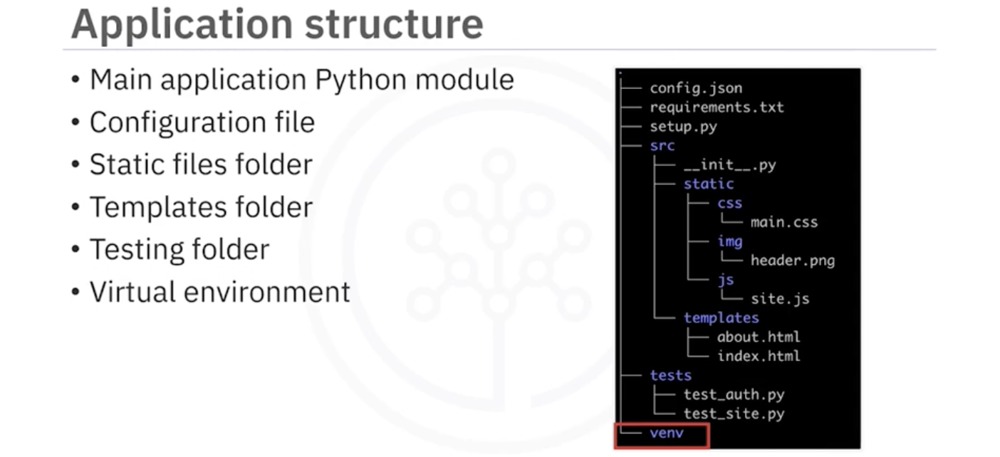

# Developing AI Applications with Python and Flask  
## API Architectures  
  
## Tests  
  
## Module vs Package vs Library  
  
  
  
  
## Flask  
  
  
- Methods  
  
- Status  
  
- Request  
  
  
- Form  
  
- Dynamic Routing  
      
      
    - We can handle multiple routes with a single function by just stacking additional route decorators above the method which should be invoked when the route is called.  
    ```
    @app.route("/")
    @app.route("/home")
    @app.route("/index")
    def home():
        return "Hello World!"
    ```  
- Error Handler  
  
- Redirect & Dynamic URLs  
```
from flask import redirect

@app.route('/admin')
def admin():
    return redirect('/login')
```
```
from flask import url_for

@app.route('/admin')
def admin():
    return redirect(url_for('login'))

@app.route('/login')
def login():
    return "<Login Page>"
```  
# Python Decorator  
``` 
def jsonify_decorator(function):
    def modifyOutput():
        return {"output":function()}
    return modifyOutput

@jsonify_decorator
def hello():
    return 'hello world'

@jsonify_decorator
def add():
    num1 = input("Enter a number - ")
    num2 = input("Enter another number - ")
    return int(num1)+int(num2)
```  
