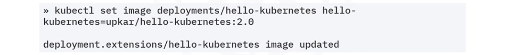
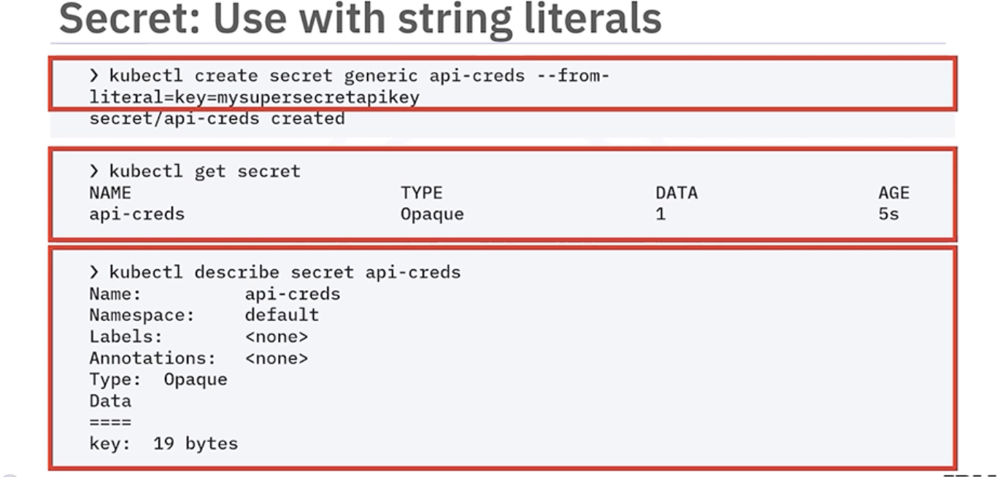
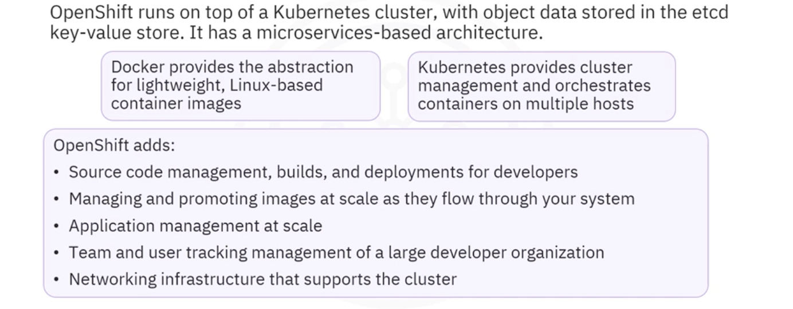
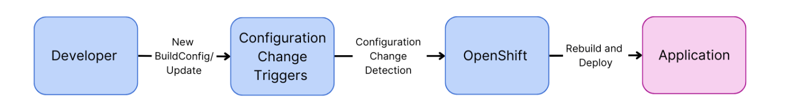

# Introduction to Containers with Docker Kubernetes & OpenShift  
## Containers  
- A container, powered by the containerization engine, is a standard unit of software that encapsulates the application code, runtime, system tools, system libraries, and settings necessary for programmers to build, ship, and run applications efficiently.  
  
  
## Docker  
  
- Docker Container Create  
  
  
  
  
  
  
    - ```docker container rm <container_id>```  - removes a container.  
    - ```docker stop``` - Stops one or more running containers. (stop the container using `docker stop` followed by the container id.)  
    - ```docker stop $(docker ps -q)``` - Stops all running containers. (The following command uses `docker ps -q` to pass in the list of all running containers.)  
    - ```docker ps``` - Lists the containers.  
    - ```docker ps -a``` - Lists the containers that ran and exited successfully.  
    - ```docker –-version``` - Displays the version of the Docker CLI.  
    - ```docker tag``` - Creates a tag for a target image that refers to a source image.  
- Docker Objects  
    - docker file: A text file that contains instructions for building a Docker image. It specifies the base image, sets the working directory, installs dependencies, copies application code, exposes ports, and defines commands to run the application.  
          
        - Example:  
        ```
        # Use the official Node.js image as the base image
        FROM node:14

        # Set environment variables
        ENV NODE_ENV=production
        ENV PORT=3000

        # Set the working directory
        WORKDIR /app

        # Copy package.json and package-lock.json files
        COPY package*.json ./

        # Install dependencies
        RUN npm install --production

        # Copy the rest of the application code
        COPY . .

        # Add additional file
        ADD public/index.html /app/public/index.html

        # Expose the port on which the application will run
        EXPOSE $PORT

        # Specify the default command to run when the container starts
        CMD ["node", "app.js"]

        # Labeling the image
        LABEL version="1.0"
        LABEL description="Node.js application Docker image"
        LABEL maintainer="Your Name"

        # Healthcheck to ensure the container is running correctly
        HEALTHCHECK --interval=30s --timeout=10s --start-period=5s --retries=3 CMD curl -fs http://localhost:$PORT || exit 1

        # Set a non-root user for security purposes
        USER node
        ```  
        - `FROM`: Specifies the base image for the Docker container.  
        - `ENV`: Sets environment variables inside the Docker container.  
        - `WORKDIR`: Defines the working directory for subsequent instructions, simplifying file path references.  
        - `COPY`: Copies files from your local machine to the container.  
        - `RUN`: Executes commands in the container during the build process.  
        - `COPY . .`: Copies all files and directories from the current directory on the local host to the current directory in the Docker container.  
        - `ADD`: include any extra files from the host machine to the Docker image.  
        - `EXPOSE`: Informs Docker that the container will listen on the specified port at runtime.  
        - `CMD`: This instruction specifies the default command and/or parameters to execute at the entry point of the container.  
        - `LABEL`: Adds metadata to the Docker image.  
        - `HEALTHCHECK`: Configures a health check to ensure the container is running correctly.  
        - `USER`: Sets the user that will run the subsequent instructions in the Dockerfile.  
    - images: a read-only template with instructions for creating a Docker container.  
        > Container image: An immutable file containing all the application assets like source code, libraries, and dependencies necessary for an application to run.  
        
          
        - Images are read-only; if you change an image, you create a new image.  
        - image naming format: ```hostname/repository:tag``` The host name identifies the image registry. A repository is a group of related container images, and the tag provides information about a specific version or variant of an image.  
    - container: a runnable instance of an image (runs as a process on the host machine), able to connect to multiple networks, attach storage to the container, or create a new image based on its current state.  
    - network: networks help isolate container communications.  
    - storage volumes: Docker uses volumes and bind mounts to persist data even after a container stops.  
    - other objects (plugins, add-ons): plugins such as storage plugins, provide the ability to connect to external storage platforms.    
- Docker Architecture  
    - Docker Daemon (dockerd): The core engine that is responsible for creating and managing Docker objects, such as images, containers, networks, and volumes.  
    - Docker Process Overview  
      
    - Docker host includes and manages:
        - Images  
        - Containers  
        - Namespace 
        - Networks  
        - Storage  
        - Plugins & add-ons  
    - Docker communications  
      
    - Registry  
          
    - Containerization process  
      
## Kubernetes  
- Container Orchestration: a process that automates the container lifecycle of a container based or containerized application. Container Life cycle: deployment, management, scaling, networking, and availability.  
      
    > SOAR: Security, Orchestration, Automation, Response  
- Kubernetes (K8s): Kubernetes is a highly portable, horizontally scalable open-source container orchestration system with automated deployment and simplified management capabilities.  
    > an open-source system for automating, deployment, scaling and management of containerized applications.  

      
    - Pods / Workloads: the smallest deployable compute object in Kubernetes and the higher-level abstractions to run workloads (one or more pods).  
    - Services expose applications running on sets of pods. Each pod is assigned a unique IP address and sets of pods have a single DNS name.  
    - Policies: created for groups of resources, ensuring that pods match to nodes so that the kubelet can find them and run the pods.  
    - Scheduling / Eviction: runs and proactively terminates one or more pods on resource-starved Nodes.  
    - Preemption: terminates lower priority Pods so that pods with higher priority can schedule and run on Nodes.  
- Kubernetes Capabilities  
  
  
  
  
- Kubernetes Ecosystem  
  
  
- Kubernetes Architecture  
      
    > etcd: a highly available distributed key value store that contains all the cluster data.  

      
    > kubelet: communicates with the kube-api-server, ensures nodes & pods running and reports their health and status to the plane.  
- Kubernetes Object  
      
    - Labels are key value pairs attached to objects. They are intended for identification of objects. Use label selectors to identify a set of objects.  
    - Namespaces provide a mechanism for isolating groups of resources within a single cluster. Namespaces provide a scope for the names of objects. Each object must have a unique name for that resource type within that namespace.  
      
      
      
    > A rolling update scales up a new version to the appropriate number of replicas and scales down the old version to zero replicas.  
    > The ReplicaSet ensures that the appropriate number of pods exist, while the Deployment orchestrates the rollout of a new version.  

    - Service  
        - A service in Kubernetes is a REST object that provides policies for accessing the pods and cluster.  
        - Why service?
          
        - Types 
            1. ClusterIP  
              
            2. NodePort  
              
            3. External Load Balancer  
              
            4. External Name  
              
    - Ingress: 
          
        - In Kubernetes, external access to cluster services is overseen by Ingress, consisting of two core components: the Ingress API object and the Ingress controller.  
              
    - DaemonSet  
      
    - StatefulSet  
      
    - Job  
        - A task with a defined start and end, commonly used for executing finite or batch operations within a Kubernetes cluster.  
          
- Kubectl (Kube Command Tool Line)  
    - 3 command types:  
        - Imperative commands: the easiest to learn, have no audit trail, and are not flexible.  
        - Imperative object configuration:  uses templates to ensure proper deployment, replication.  
        - Declarative object configuration: automated, requires no user input, and is ideal for production systems.  
    - Command structure  
      
    - **Commands**  
          
        - ```kubectl version``` - Prints the client and server version information.  
        - ```kubectl get pods```  
        - ```kubectl get pods --all-namespaces```  
        - ```kubectl get pods -o wide``` - Lists all the Pods with details.  
        - ```kubectl get pod <pod-name> --show-labels```
        - ```kubectl get deployment my-dep```  
        - ```kubectl get services```  
        - ```kubectl apply -f ./my1.yaml -f ./my2.yaml```  
        - ```kubectl apply -f https://git.io/vPieo```  
        - ```kubectl scale --replicas=3 rs/foo```  
        - ```kubectl scale --replicas=3 -f foo.yaml```  
        - ```kubectl config get-clusters``` - Displays all clusters defined in the kubeconfig.  
        - ```kubectl config get-contexts``` - Displays the current context.  
        - ```kubectl expose deployment/hello-world``` - expose the Deployment `hello-world` to the internet via a Kubernetes Service, and create a service of type ClusterIP.  
        - ```kubectl rollout restart deployment hello-world``` - Restart the Deployment `hello-world` so that the containers restart. It is necessary when configuration is changed, because the environment variables are set at start time.  
        - ```kubectl port-forward deployment.apps/myapp 3000:3000``` - Start an application on port-forward.  
        - ```kubectl run -i --tty load-generator --rm --image=busybox:1.36.0 --restart=Never -- /bin/sh -c "while sleep 0.01; do wget -q -O- <app URL>; done"``` - generate load on the app by specifying the \<app URL\>.  
    - Create a Kubernetes Service using nginx image  
        > YAML file of a Service  
        > ```
        > apiVersion: v1
        > kind: Service
        > metadata:
        >     name: myapp-service
        > spec:
        >     selector:
        >         app: myapp
        >     ports:
        >         - protocol: TCP
        >             port: 80
        >             targetPort: 3000
        >     type: NodePort
        > ```  
        1. ```kubectl create deployment my-deployment1 --image=nginx``` - create a Deployment named my-deployment1 using the nginx image.  
            > The nginx image is a popular web server and reverse proxy server.  
        2. ```kubectl expose deployment my-deployment1 --port=80 --type=NodePort --name=my-service1``` - Expose the deployment as a service.  
        3. ```kubectl label pods <pod-name> environment=deployment``` - Label a specific pod with the key-value pair: environment=deployment.  
        4. ```kubectl run my-test-pod --image=nginx --restart=Never``` - Run a test pod using the nginx image and the pod will not restart automatically if it stops for any reason.  
        5. ```kubectl logs <pod-name>``` - Show logs.  
    - **Deploying a StatefulSet**  
        1. Edit a yaml file  
            ```
            apiVersion: apps/v1
            kind: StatefulSet
            metadata:
                name: my-statefulset
            spec:
                serviceName: "nginx"
                replicas: 3
                selector:
                    matchLabels:
                        app: nginx
                template:
                    metadata:
                        labels:
                            app: nginx
                    spec:
                        containers:
                        - name: nginx
                            image: nginx
                            ports:
                            - containerPort: 80
                                name: web
                volumeClaimTemplates:
                - metadata:
                        name: www
                    spec:
                        accessModes: [ "ReadWriteOnce" ]
                        resources:
                            requests:
                                storage: 1Gi
            ```
            - `apiVersion: apps/v1` & `kind: StatefulSet`: Establishes that this resource is a StatefulSet, leveraging the stable, production‑ready apps/v1 API.  
            - `metadata.name: my-statefulset`: Assigns a human‑readable identifier to the StatefulSet.  
            - `spec.serviceName: "nginx"`: Binds the StatefulSet to a headless Service named “nginx,” ensuring each pod has a stable network identity.  
            - `spec.replicas: 3`: Orchestrates three pod replicas, each with its own persistent identity.  
            - `spec.selector.matchLabels`: Directs the StatefulSet to manage pods labeled app: nginx.  
            - `spec.template`: Defines the pod blueprint:  
                - `metadata.labels: app`: nginx ensures new pods carry the matching label.  
                - `spec.containers` configures the `nginx` container on port 80, named “web.”  
            - `volumeClaimTemplates`: Automates the creation of a PersistentVolumeClaim named www for each replica, each requesting 1 Gi of storage with ReadWriteOnce access.  
        2. ```kubectl apply -f statefulset.yaml``` - Apply the StatefulSet configuration.  
        3. ```kubectl get statefulsets```
    - Implementing a DaemonSet  
        1. Edit a yaml file  
            ```
            apiVersion: apps/v1
            kind: DaemonSet
            metadata:
                name: my-daemonset
            spec:
                selector:
                    matchLabels:
                        name: my-daemonset
                template:
                    metadata:
                        labels:
                            name: my-daemonset
                    spec:
                        containers:
                        - name: my-daemonset
                            image: nginx
            ```
            - `apiVersion: apps/v1 & kind: DaemonSet`: Declares this resource as a DaemonSet under the stable apps/v1 API.  
            - `metadata.name: my-daemonset`: Provides the DaemonSet’s unique name.  
            - `spec.selector.matchLabels`: Targets pods labeled name: my-daemonset for scheduling.  
            - `spec.template.metadata.labels`: Labels the pod template so it matches the selector.  
            - `spec.template.spec.containers`: Defines a single container named my-daemonset using the nginx image.  
        2. ```kubectl apply -f daemonset.yaml```  
        3. ```kubectl get daemonsets```  
    - YAML file of a Deployment `deployment.yml`  
        ```
        apiVersion: apps/v1
        kind: Deployment
        metadata:
            name: myapp
            labels:
                app: myapp
        spec:
            replicas: 1
            selector:
                matchLabels:
                    app: myapp
            strategy:
                rollingUpdate:
                    maxSurge: 25%
                    maxUnavailable: 25%
                type: RollingUpdate
            template:
                metadata:
                    labels:
                        app: myapp
                spec:
                    containers:
                    - image: us.icr.io/sn-labs-u1529230703/myapp:v1
                        imagePullPolicy: Always
                        name: myapp
                        ports:
                        - containerPort: 3000
                            name: http
                        resources:
                            limits:
                                cpu: 50m
                            requests:
                                cpu: 20m
        ```
        - `apiVersion`: apps/v1 specifies the version of the Kubernetes API being used and the resource type (Deployment).  
        - `kind`: Deployment indicates that this YAML defines a Deployment object.  
        - `metadata` section includes metadata about the Deployment, such as its name and labels.  
        - `spec` section defines the desired state for the Deployment, including the number of replicas, update strategy, and pod template.  
        - `replicas`: 1 specifies that there should be one replica of the application running.  
        - `selector` defines how the Deployment finds which Pods to manage, using labels.  
        - `strategy` specifies the update strategy for the Deployment, here using rolling updates with certain constraints.  
        - `template` describes the Pod template used for creating new Pods.  
        - `containers` lists the containers within the Pod.  
        - `image` specifies the Docker image to use for the container.  
        - `imagePullPolicy`: Always ensures that the latest image is always pulled from the registry.  
        - `name` assigns a name to the container.  
        - `ports` section specifies which ports should be exposed by the container.  
        - `resources` defines resource requests and limits for the container, such as CPU.  
- **ReplicaSet**  
  
  
  
- **Autoscaling**  
    - 2 layers:  Cluster/Node level, Pod level. 
    - 3 autoscalar Types: Horizontal Pod Autoscalar (HPA), Vertical Pod Autoscalar (VPA), Cluster Autoscalar (CA).  
      
      
    ```kubectl get hpa hello-kubernetes``` - check the current status of the newly-made Horizontal Pod Autoscaler.  
    ```kubectl get hpa hello-kubernetes --watch``` - enable to observe the replicas increase in accordance with the autoscaling.  
    - Implement VPA  
        1. Create a VPA configuration  
        ```
        apiVersion: autoscaling.k8s.io/v1
        kind: VerticalPodAutoscaler
        metadata:
            name: myvpa
        spec:
            targetRef:
                apiVersion: "apps/v1"
                kind: Deployment
                name: myapp
            updatePolicy:
                updateMode: "Auto"  # VPA will automatically update the resource requests and limits
        ```
        2. ```kubectl apply -f vpa.yaml``` - Apply the VPA configuration.  
        3. Retrieve the details of the VPA:  `kubectl get vpa`, `kubectl describe vpa myvpa`.  
    - Implement HPA  
        1. Create an HPA configuration  
        ```
        apiVersion: autoscaling/v1
        kind: HorizontalPodAutoscaler
        metadata:
            name: myhpa
        spec:
            scaleTargetRef:
                apiVersion: apps/v1
                kind: Deployment
                name: myapp
            minReplicas: 1         # Minimum number of replicas
            maxReplicas: 10        # Maximum number of replicas
            targetCPUUtilizationPercentage: 5  # Target CPU utilization for scaling
        ```
        2. ```kubectl apply -f hpa.yaml``` - Apply the HPA configuration.  
        3. ```kubectl proxy```  
        4. ```for i in `seq 100000`; do curl -L localhost:8001/api/v1/namespaces/sn-labs-$USERNAME/services/myapp/proxy; done```   
        5. ```kubectl get hpa myhpa --watch```   
- Deployment Strategies  
    - Recreate  
      
    - Rolling (ramped)  
      
    - Blue / green  
      
    - Canary  
      
    - A / B testing  
      
    - Shadow  
      
- **Rolling updates**  
      
    - Apply new image to the deployment  
      
      
    ```kubectl rollout restart``` - Restarts the resource so that the containers restart.  
    ```kubectl rollout history deployment/guestbook``` - see the history of deployment rollouts.  
    ```kubectl rollout history deployments guestbook --revision=2``` - see the details of a specific Revision of the deployment rollout.  
    - Roll back  
      
    ```kubectl rollout undo deployment/guestbook --to-revision=1``` - undo the deploymnent and set it to a specified Revision.  
- ConfigMap & Secret  
    - ConfigMaps and Secrets are used to store configuration information separate from the code so that nothing is hardcoded. It also lets the application pick up configuration changes without needing to be redeployed.
    - **ConfigMap**  
        - limited to 1 MB of data.  
        - A ConfigMap has optional data and binary data fields and no spec field in the template.  
        - Config name must be a valid DNS subdomain name.  
          
        ```kubectl create configmap myapp-config --from-literal=env-var1=value1 --from-literal=env-var2=value2```
          
          
    - Secret  
          
          
          
        - Create a Secret and update the deployment  
            1. Create a Secret `secret.yaml`  
                ```
                apiVersion: v1
                kind: Secret
                metadata:
                    name: myapp-secret
                type: Opaque
                data:
                    username: bXl1c2VybmFtZQ==
                    password: bXlwYXNzd29yZA==
                ```
            2. Update the deployment to utilize the secret. Add the following lines at the end of `deployment.yaml`.  
                ```
                                env:
                                - name: MYAPP_USERNAME
                                    valueFrom:
                                        secretKeyRef:
                                            name: myapp-secret
                                            key: username
                                - name: MYAPP_PASSWORD
                                    valueFrom:
                                        secretKeyRef:
                                            name: myapp-secret
                                            key: password
                ```
                - `name:` - Defines the environment variables: 'MYAPP_USERNAME' and 'MYAPP_PASSWORD', respectively.  
                - `valueFrom:` - Specifies that the value of the environment variable should be sourced from another location rather than being hardcoded.  
                - `secretKeyRef:` - Indicates that the value of the environment variable should come from a Kubernetes secret.  
                - `name: myapp-secret` - Specifies the name of the secret 'myapp-secret', from which to retrieve the value.  
                - `key:` - Specifies which key within the secret is to be used for the value of the 'MYAPP_USERNAME' and 'MYAPP_PASSWORD' environment variables, respectively.  
            3. Apply the secret and deployment: `kubectl apply -f secret.yaml`, `kubectl apply -f deployment.yaml`.  
          
- Binding Service  
    - the process needed to consume external Services or backing Services, including REST APIs, databases, and event buses in your applications.  
    - Binding an external Service to your deployment automatically provides the credentials to use the Service inside the code.  
    - Binding manages configuration and credentials for back-end Services while protecting sensitive data.  
- Volumes  
    - Volume: A directory containing data, accessible to multiple containers in a Pod.  
    - Volume Mount: entails mounting of the declared volume into a container in the same Pod.  
    - Volume Plugin: A Volume Plugin enables integration of storage within a Pod.  
    - PersistentVolume (PV): A PV is a storage resource provisioned by an administrator in the cluster that exists independently of any Pod that might use it. It is a cluster-wide resource that can be dynamically provisioned or statically defined, and has a lifecycle managed by the cluster administrator.  
        ```
        apiVersion: v1
        kind: PersistentVolume
        metadata:
            name: myapp-volume
        spec:
            capacity:
                storage: 1Gi
            accessModes:
                - ReadWriteOnce
            hostPath:
                path: /data
        ```  
        - `apiVersion: v1`: It specifies the Kubernetes API version being used.  
        - `kind: PersistentVolume`: It indicates that this YAML describes a PersistentVolume resource.  
        - `metadata`: It contains metadata about the PersistentVolume.  
        - `name: myapp-volume`: It specifies the name of the PersistentVolume, which is 'myapp-volume' in this case.  
        - `spec`: This defines the specification of the PersistentVolume.  
        - `capacity`: It specifies the capacity of the PersistentVolume.  
        - `storage: 1Gi`: This indicates that the PersistentVolume has a storage capacity of 1 gigabyte.  
        - `accessModes`: It defines the access modes for the PersistentVolume.  
        - `ReadWriteOnce`: Specifies that the volume can be mounted as read-write by a single node.  
        - `hostPath`: Specifies a host path volume source.  
        - `path: /data`: Indicates that the PersistentVolume is backed by a directory on the host (/data in this case).  
    - PersistentVolumeClaim (PVC): A PVC is a request for storage by a user or a Pod which consumes PersistentVolume(s). PVCs provide a way for users to request the storage resources they need. They are namespace-specific and can only request storage within their namespace, with their lifecycle managed by the user or developer who creates them.  
        ```
        apiVersion: v1
        kind: PersistentVolumeClaim
        metadata:
            name: myapp-pvc
        spec:
            accessModes:
                - ReadWriteOnce
            resources:
                requests:
                    storage: 1Gi
        ```  
        - `apiVersion: v1`: Specifies the Kubernetes API version being used for the PersistentVolumeClaim.  
        - `kind: PersistentVolumeClaim`: Indicates that this YAML describes a PersistentVolumeClaim resource.  
        - `metadata`: Contains metadata about the PersistentVolumeClaim.  
        - `name: myapp-pvc`: Specifies the name of the PersistentVolumeClaim, which is myapp-pvc in this case.  
        - `spec`: Defines the specification of the PersistentVolumeClaim.  
        - `accessModes`: Defines the access modes for the PersistentVolumeClaim.  
        - `ReadWriteOnce`: Specifies that the volume can be mounted as read-write by a single node.  
        - `resources`: Specifies the resource requirements for the PersistentVolumeClaim.  
        - `requests`: Indicates the requested resources.  
        - `storage: 1Gi`: Specifies that the PersistentVolumeClaim requests a storage capacity of 1 gigabyte.  
## Red Hat OpenShift  
- an enterprise-ready Kubernetes container platform built for the hybrid Cloud strategy.  
  
  
- Architecture  
  
- Component  
      
    >   
- Build  
    - build is a process that transforms inputs into an object. Build inputs (in order of precedence) include inline Dockerfile definitions, content extracted from existing images, git repositories, binary (local) inputs, input secrets, and external artifacts.  
    - BuildConfig  
          
          
    - Commonly used build strategies:
        - Source to Image (S2I) strategy  
          
        - Docker build strategy  
        - Custom build strategy  
          
    - Build Triggers  
        1. Webhook Triggers  
            - commonly used to integrate with external systems, such as GitHub, to automate builds based on specific repository events.  
              
        2. Image Change Triggers  
            - particularly useful for maintaining up-to-date applications with the latest dependencies or security patches.  
              
        3. Configuration Change Triggers  
            - allows builds to automatically reflect changes in the build configuration, such as updates to source code repositories or changes in build strategies.  
              
- Operator  
      
      
    - Service Broker vs Operator
        > Service Broker: Provides a short-running process that cannot perform the consecutive day’s operations such as upgrades, failover, or scaling.  

      
    - Custom resource definition (CRD) & Custom controller  
        - CRDs: Custom code that defines a resource to add to your Kubernetes API server without building a complete custom server.  
            - CRDs store and retrieve objects in the Kubernetes API. **CRDs extend Kubernetes** functionality beyond built-in resources, like deployments and pods, making the Kubernetes API more modular and flexible.  
        - Custom controllers: Reconcile the custom resources (CRDs) actual state with its desired state.  
          
    - Operator Framework  
      
    - Operator Registry: Stores CRDs, cluster service versions (CSVs), and Operator metadata for packages and channels. It runs in Kubernetes or OpenShift clusters to provide the Operator catalog data to OLM.  
    - Operator Lifecycle Manager: (or OLM) Controls the install, upgrade, and role-based access control (or RBAC) of Operators in a cluster.  
    - Operator Maturity Model  
      
    - Operator SDK: (which includes Helm, Go, and Ansible) Helps authors build, test, and package their Operators without requiring knowledge of Kubernetes API complexities.  
- Istio  
    - Service Mesh  
        - A dedicated infrastructure layer that ensures secure and reliable service-to-service communication.  
        - A service mesh provides traffic management to control the flow of traffic between services, security to encrypt traffic between services, and observability of service behavior to troubleshoot and optimize applications.  
    - Istio  
        - Istio is a platform-independent and popular service mesh platform, often used with Kubernetes.  
        - It intelligently controls the flow of traffic and API calls between services, conducts a range of tests and reduces the complexity of managing network services.  
        - Istio secures services through authentication, authorization, and encryption.  
        - Istio provides control by defining policies that can be enforced across an entire fleet.  
        - With Istio, you can observe traffic flow in your mesh so you can trace call flows, dependencies, and you can view service communication metrics such as latency, traffic, errors and saturation.  
          
          
        - 2 main components: istio control plane, istio data plane.  
          
        - 4 service communication metrics for basic service monitoring needs: latency, traffic, errors, and saturation.  
> Man-in-the-middle attacks: A man-in-the-middle (MiTM) attack is a type of cyber-attack where the attacker secretly intercepts and relays messages between two parties who believe they are communicating directly with each other. The attack is a type of eavesdropping in which the attacker intercepts and then controls the entire conversation.

