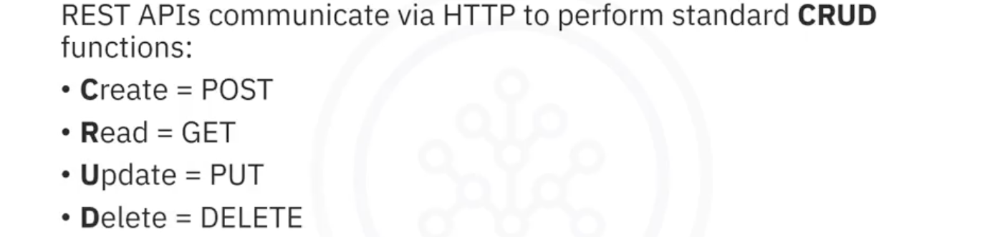
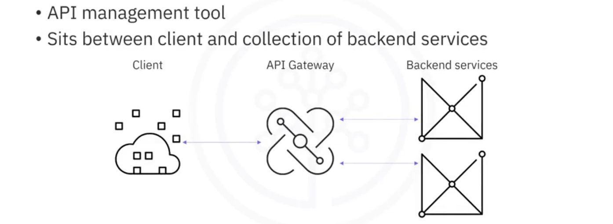
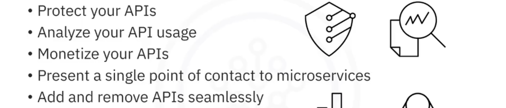
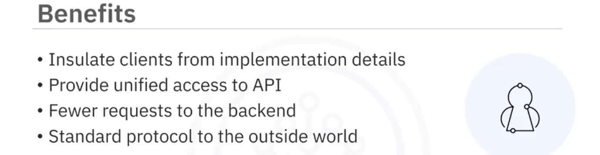
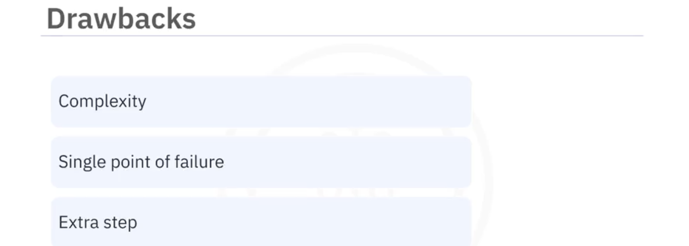
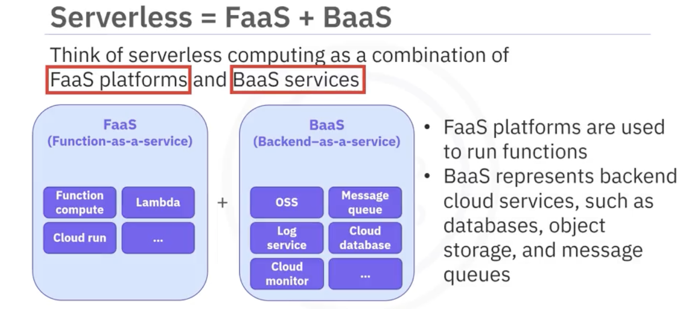
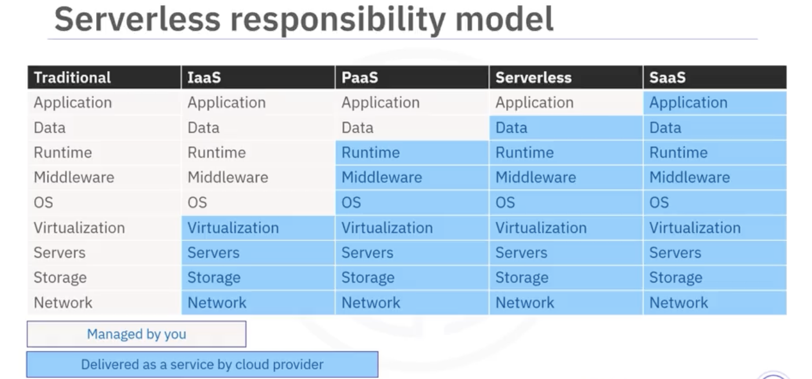
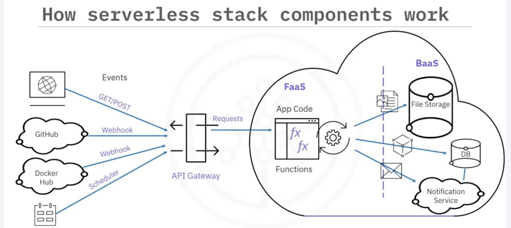
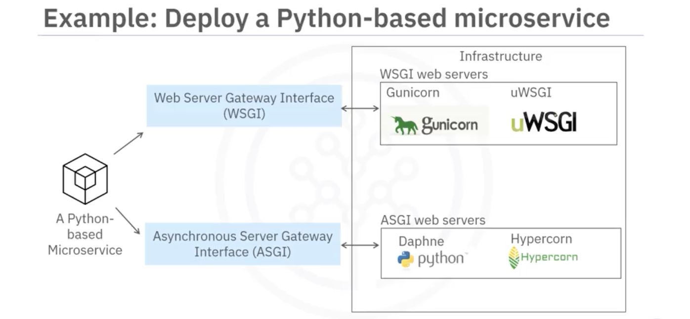

# Application Development using Microservices and Serverless  
## Microservices  
- Microservices architecture is an approach in which a single application is composed of many loosely coupled and independently deployable smaller services.  
- Patterns  
    - Single-page application (SPA): Loads one interface that never reloads.  
    - Backend for Frontend (BFF): Inserts a layer between the user experience and the resources. allowing for customized user experiences between channels.  
    - Strangler: Manage the refactoring of a monolithic application in stages.  
    - Service discovery: Could be used by load balancer to perform health checks and rebalance traffic on service failures.  
    - Entity and Aggregate  
    - Adapter  
## REST  
- REpresentational State Transfer  
- Characteristics  
    - Requests managed through HTTP  
          
    - Stateless client-server communication  
        - Stateless means each request contains all the information required to process it.  
    - Uniform interface between components  
        - The same piece of data, such as the product id, belongs to only one uniform resource identifier (URI).  
- API Gateway
  
  
  
  
> GraphQL: A language-agnostic Query Language for API, allowing client to fetch only what's needed.  
## Serverless Computing  
- Building and running applications that do not require server management.  
  
  
- Function as a Service (FaaS): FaaS is a type of cloud-computing service that allows you to execute code in response to events without a complex infrastructure.  
  
>   
