# Introduction to Test and Behavior Driven Development  
## Testing  
- Levels of testing: Unit Tests -> Integration Tests -> System Tests -> Acceptance Tests.  
- Traditional Release Cycle  
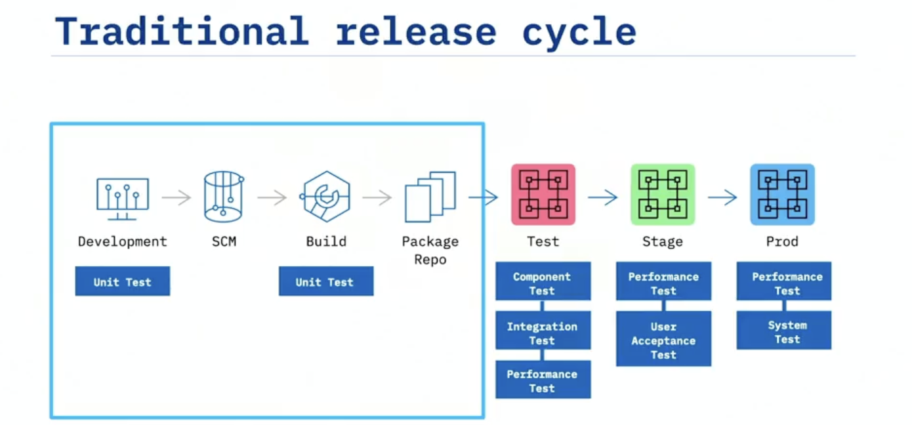  
- TDD & BDD  
    - Behavior driven development
        - a higher level test, for integration, system and acceptance Tests.  
        - test the behavior of the system from the outside in.  
        - ensure that you're building the right thing.  
    - Test driven development: 
        - a lower level test, for Unit Tests.  
        - test the functions of the system from the inside out.  
        - ensure that you're building the thing right.  
## Test Driven Development  
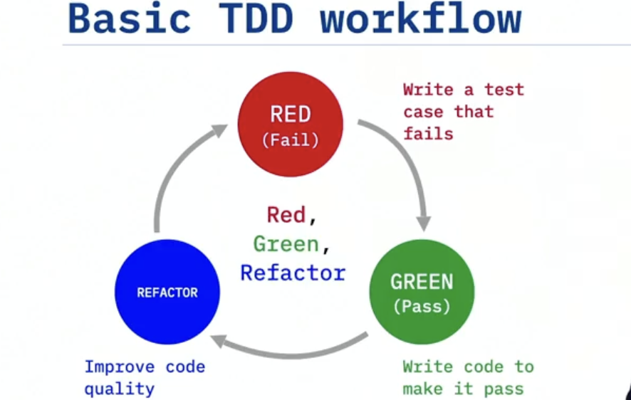  
- Tools  
    - PyUnit  
        - Run unit test: ```python3 -m unittest -v```  
    - Nose & Pinocchio & Coverage  
        - ```python3 -m pip install nose```  
        - ```python3 -m pip install pinocchio```  
        - ```python3 -m pip install coverage``` 
        > - list the dependencies in a requirements file: requirements.txt  
        > ```
        > nose==1.3.7
        > pinocchio==0.4.3
        > coverage==6.3.2
        > ```  
        > - run ```python3 -m pip install -r requirements.txt```  
        - ```nosetests --with-spec --spec-color --with-coverage```  
        - ```coverage report -m``` - Get the missing coverage report (shows specific lines that needs test cases).    
        - ```nosetests --stop``` - find out the first test to work on.  
        - With config file:  
            1. setup.cfg (`cover-package=triangle` - triangle is the module to be tested)  
            ```
            [nosetests]
            verbosity=2
            with-spec=1
            spec-color=1
            with-coverage=1
            cover-erase=1
            cover-package=triangle

            [coverage:report]
            show_missing = True
            ```  
            2. run ```nosetests```  
- Test Code  
    - Test Code in test_xxx.py:  
    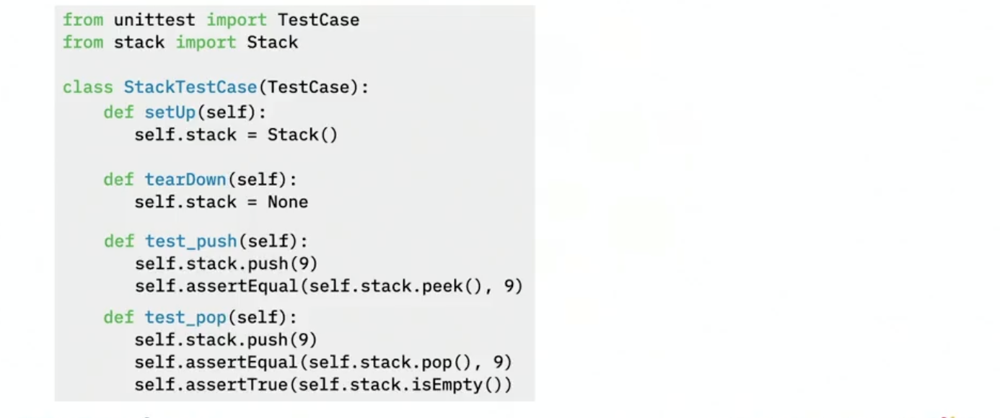  
    - Common Assertions  
        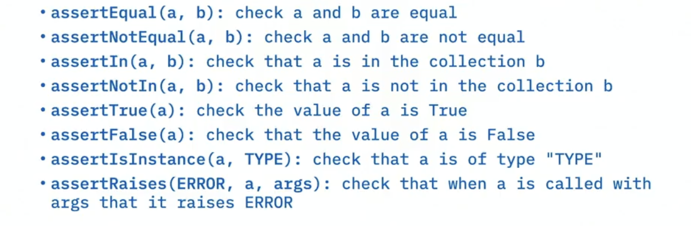  
        - ```assertAlmostEqual(a, b)``` - for floating point numbers, only checks 7 decimal places for accuracy.  
    - Test Fixtures  
    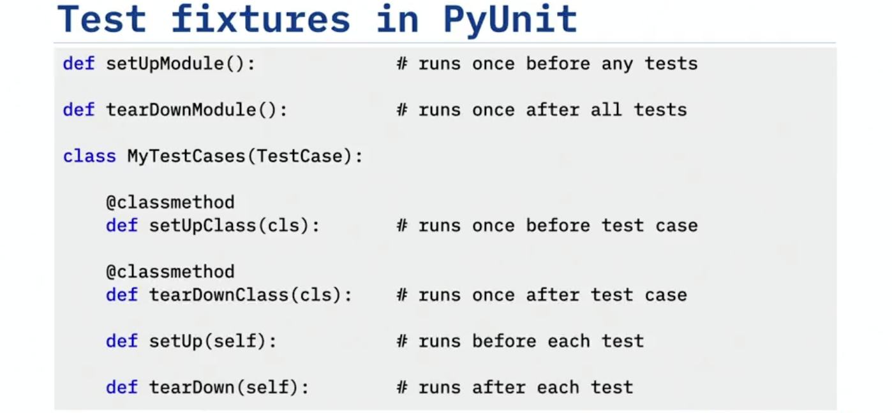  
> - ```flask_routes``` - shows all of the valid routes that have been implemented.  
> 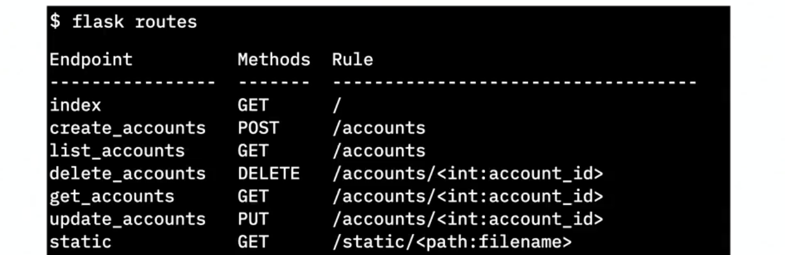  

- FactoryBoy  
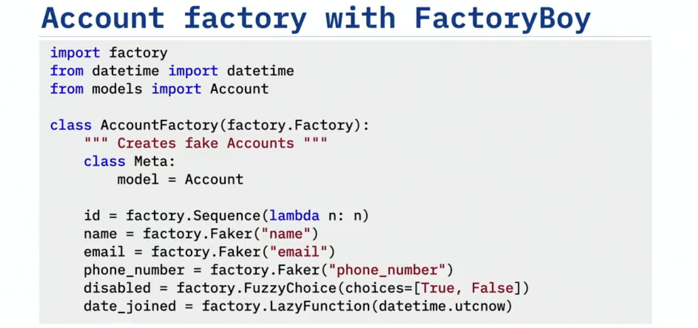  
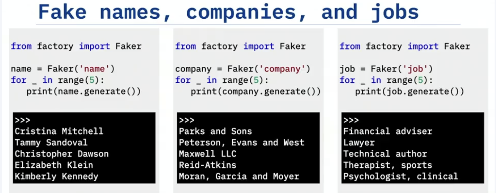  
> [Documentation on Standard Providers](https://faker.readthedocs.io/en/master/providers.html)  
> [Documentation on Faker Providers](https://faker.readthedocs.io/en/master/providers/baseprovider.html)  
> [Documentation on Fuzzy Attributes](https://factoryboy.readthedocs.io/en/stable/fuzzy.html)  

- Moking  
    - Mocking is a process for creating objects that mimic the behavior of real objects.  
    - Anytime you want to isolate your tests from a remote component or external system, you can use a mock to take its place.  
    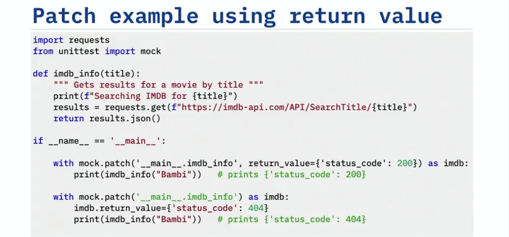  
    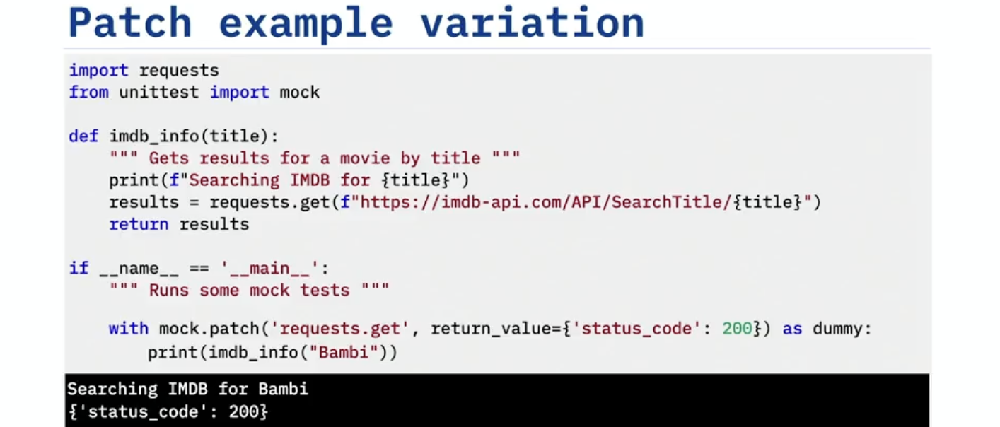  
    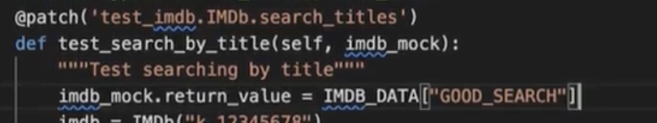  
    - a new parameter `imdb_mock` added to the test method call, representing the patched object.  
    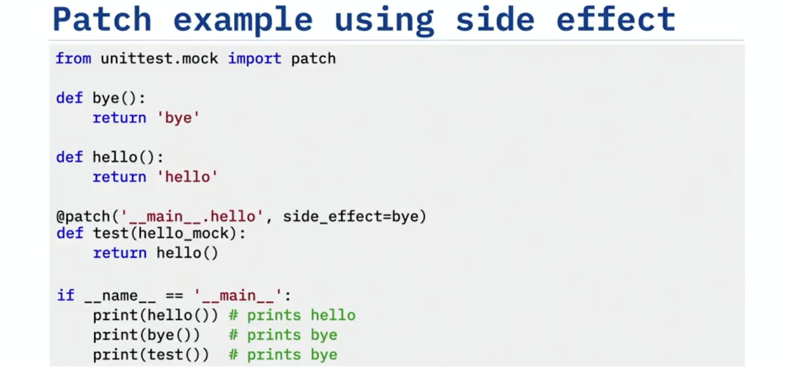  
    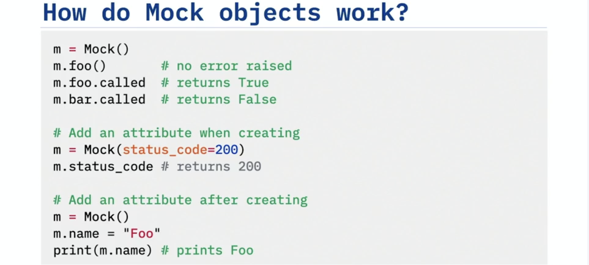  
    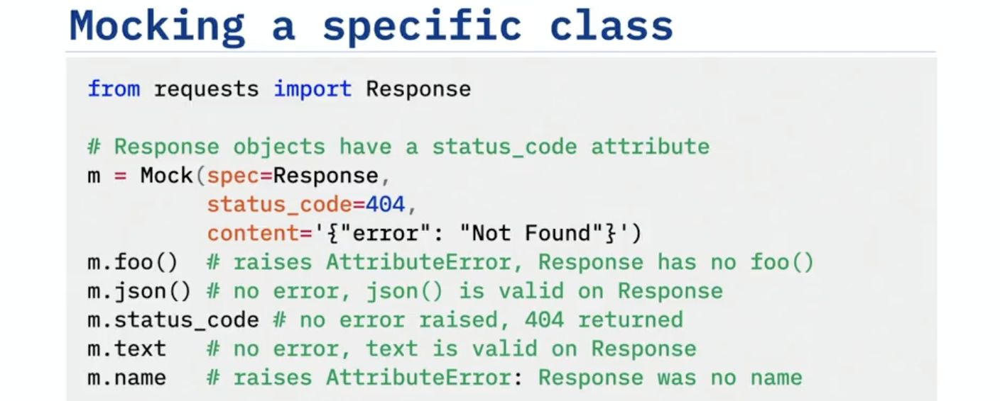  
    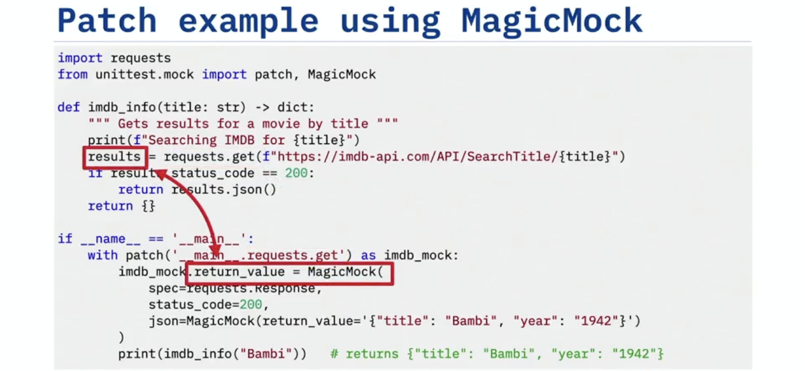  
## Behavior Driven Development  
- BDD work flow  
    - Create examples or scenarios to describe the desired behavior.  
    - Run those examples as automated tests.  
    - Write additional tests as needed.  
- Gherkin  
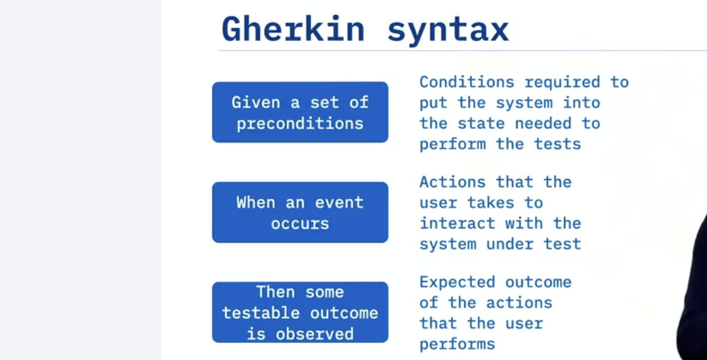  
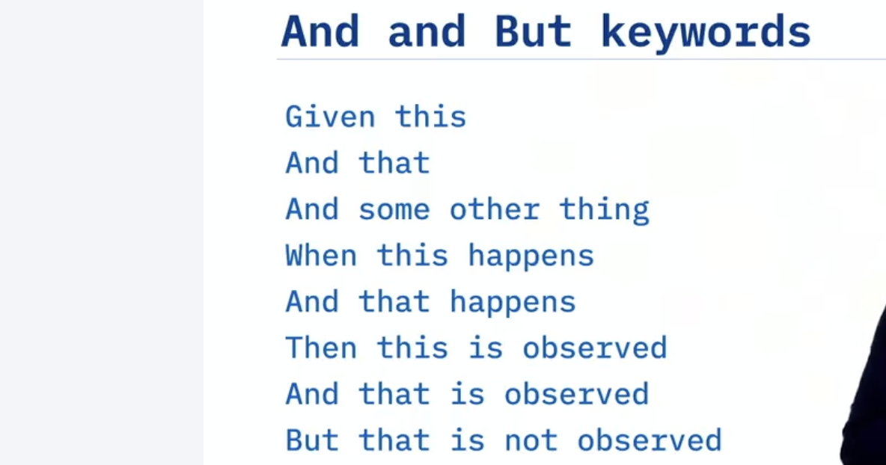  
- Bahave  
    - set up the folder structure  
    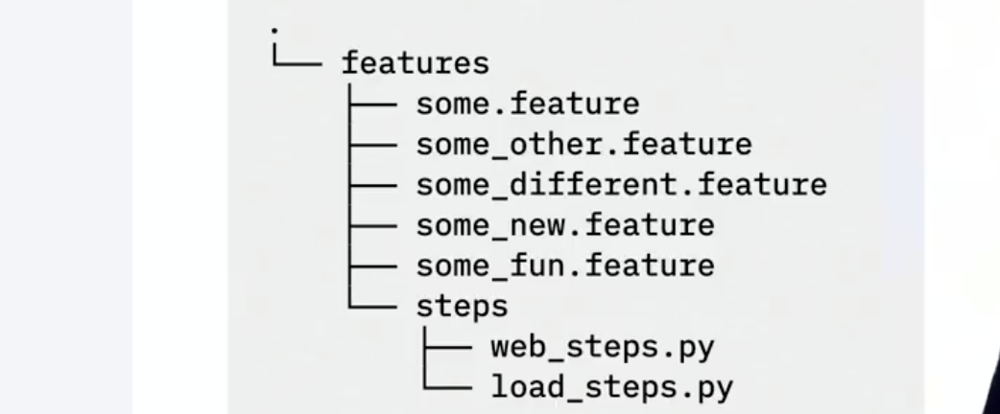  
    - run `behave`. Behave reads the steps in each feature file, looks for a matching Python step in the steps files, and executes those functions.  
    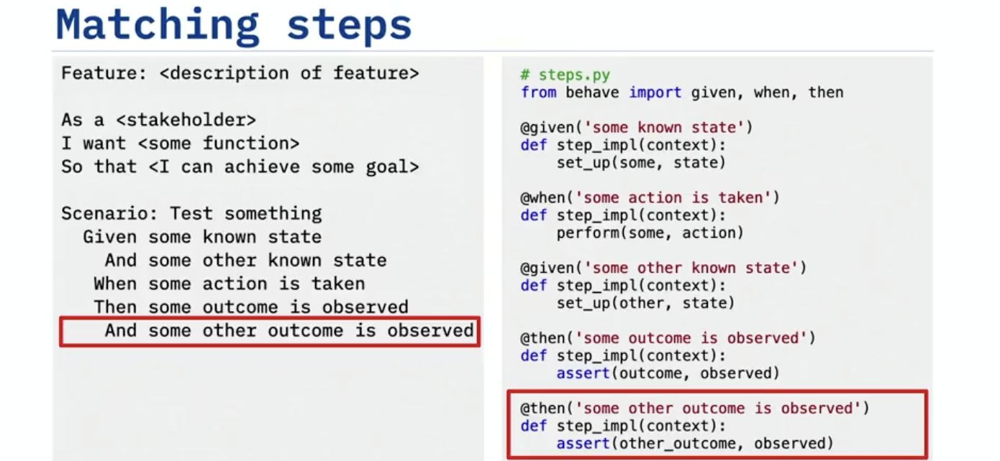  
    - test fixture  
        - set up `environment.py`  
            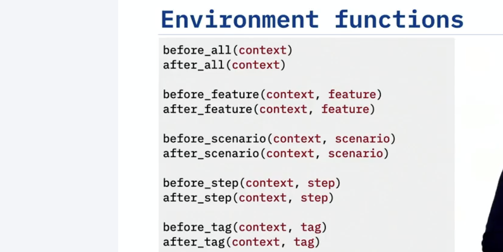  
            - `before_all()`: Any code you place in this test fixture will execute once before all the features.  
            - `after_all()`: Any code you place in this test fixture will execute once after all the features.  
            - `before_feature()`: Any function in this test fixture will run before each feature.  
            - `after_feature()`: Any function in this test fixture will run after each feature.  
            - `before_scenario()`: Any code you place in this test fixture will execute once before each scenario.  
            - `after_scenario()`: Any code you place in this test fixture will execute once after each scenario.  
            - `before_step()`: Any code you place in this test fixture will execute once before each step.  
            - `after_step()`: Any code you place in this test fixture will execute once after each step.  
            - `before_tag()`: Any code you place in this test fixture will execute once before each tag.  
            - `after_tag()`: Any code you place in this test fixture will execute once after each tag.  
            - `context` will be passed to every step in your test suite. Therefore, anything you assign to this context will be available to all of the steps.  
            - Imports any configuration parameters from the Environment.
                ```
                from os import getenv
                MESSAGE = getenv('MESSAGE', 'Hello')
                ```
    - Background: is a test fixture that you can use to specify the context once and then establish it before **every scenario** in the feature.  
        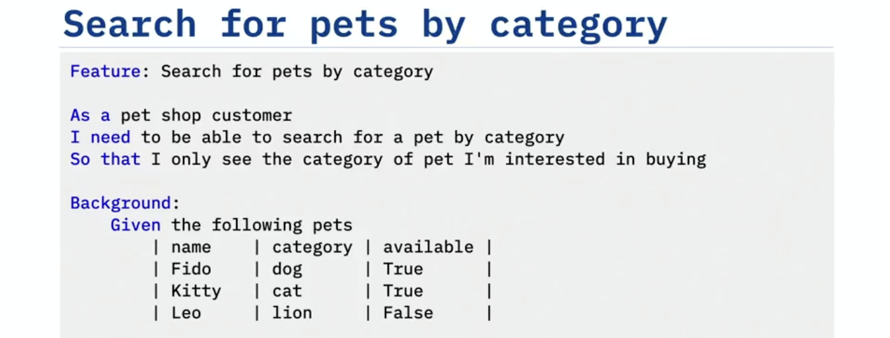  
        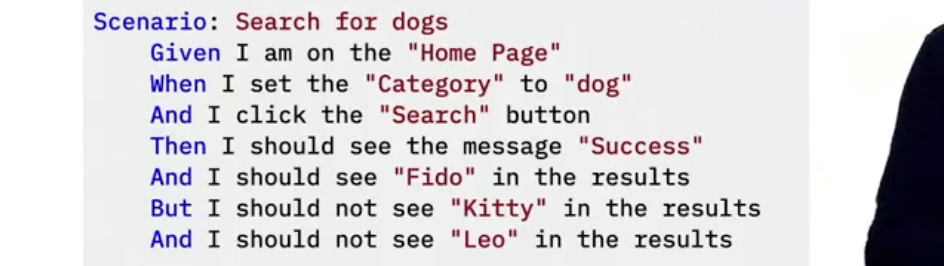 
        - load the test data  
        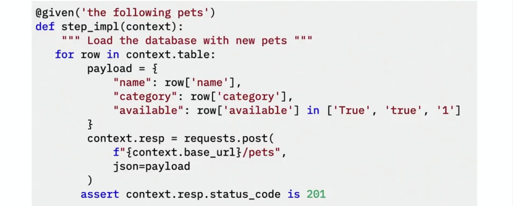  
    - Variable substitution  
        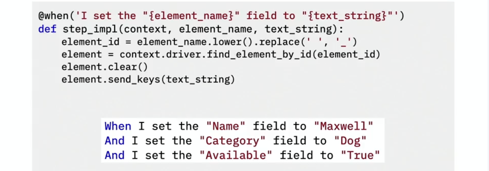  

