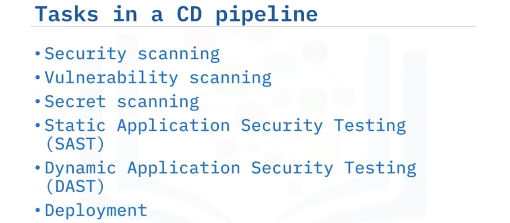
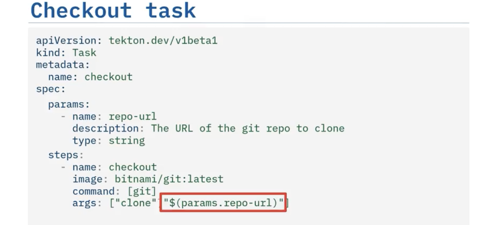
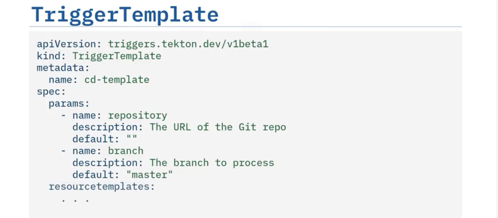

# Continuous Integration and Continuous Delivery (CI CD)  
## CI CD  
- Continuous Integration is an automation process that allows developers to continuously integrate their code back into the main or master branch.  
- Continuous Delivery is the next phase after CI, that takes integrated code and deploys it somewhere like a staging, testing, or preproduction server.  
- Continuous Deployment is delivering the code to production.  
  
  
- Infrastructure as Code  
    - An approach in which infrastructure configuration and management are automated using code.  
    - IaC tools can speed up the process of provisioning the development environment’s infrastructure.  
      
## Continuous Integration  
- Main features  
    - short-lived branches  
    - frequent pull requests  
    - automated CI tools  
- Social Coding  
  
- CI Pipeline: The CI pipeline validates, packages, and builds essential components, creating deployable artifacts like container images and helm charts. It ensures versioning and resource preparation.
- Git  
  
  
  
- Github Actions 
  
  
  
  
  
  
  
> Always check the *GitHub Actions Marketplace* for any action you may want to perform.  

  
## Continuous Delivery  
- A series of practices designed to ensure that code can be rapidly and safely deployed to production by delivering every change to a production-like environment.  
  
  
  
> - Dynamic Application Security Testing (DAST): Dynamic Application Security Testing (or DAST) scans for incorrect security assumptions hidden in the source code.  
> - Static Application Security Testing (SAST): Identifies vulnerabilities of the entire code base, such as SQL injections and cross-site scripting.  

- Tekton  
      
    - Tekton is a set of Kubernetes custom resource definitions, or CRDs.  
    - Pipeline, Tasks & Steps  
        - EventListeners listen for external events, TriggerBindings respond to those events and bind parameters from them, and TriggerTemplates create PipelineRuns that pass the parameters to the pipeline.  
          
        - Hello World Pipeline  
          
          
          
        >   

          
    - Events & Triggers  
          
          
          
          
          
          
          
        > Error: unknown flag: --latest

        - `tkn pipelinerun ls` - list all the pipelinerun  
        - `tkn pipelinerun logs --last` - show the logs of the last pipelinerun 
    - Tekton Hub / Tekton Catalog  
          
        - ```tkn hub install task <name>``` - install the task from Tekton Hub  
          
          
    - Quality Check & Testing  
          
          
          
    - Build image  
        - ```tkn hub search --kinds task build``` - search image building task from Takton Hub  
        - ```tkn clustertask ls``` - list cluster level task that has been installed, making sure you don't have to install it locally into you namespace if it already exists.  
        - using a cluster-level installed task:  
              
    - Deploy  
        - ```tkn hub info task <task_name>``` - describe the information about the task.  
          
          
- **Continuous Compliance** pipeline ensures that organizations maintain security and compliance standards.  
- Openshift Pipelines  
  
- GitOps  
    - GitOps is a set of practices that use Git pull requests to manage infrastructure and application configurations.  
    - principles:  
        - Defines system definition as code.  
        - Versions and defines desired system configration.  
        - Provide GitChanges that enable pull requests.  
        - Offers a controller to avoid configration drifts.  
    - patterns on Openshift  
        - On-Cluster Resource Reconciler pattern  
        - External Resource Reconciler pattern  
