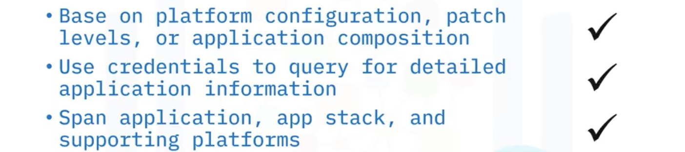
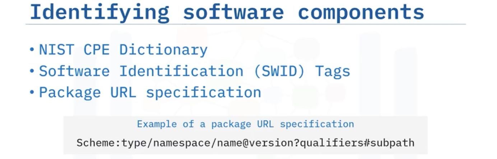

# Application Security for Developers and DevOps Professionals  
## DevSecOps  
  
## Network Security  
- OSI Model  
    - Open Systems Interconnection Model  
          
        - Application layer: The seventh and topmost layer of the OSI model is used by developers for building and deploying applications.  
        - Presentation layer: The sixth layer of the OSI model focuses on the syntax and semantics of data being transmitted from one point to another.  
        - Session layer: The fifth OSI model layer establishes multiple sessions from different machines while establishing consistent sessions if a crash occurs.  
        - Transport layer: The fourth layer of the OSI model accepts transmissions or data from the network layer and chops them into smaller units or packets for passing them back to the network layer.  
        - Network layer: The third layer of the OSI model handles data transmission and control of the subnet.  
        - Data link layer: The second layer of the OSI model transforms the transmitted raw data into a line free from undetected errors.  
        - Physical layer: The lowest layer of the OSI model transmits bits of raw information.  
- Securing layers for application development  
    - Secure the web application layer  
        - run vulnerability scanners, run tests, and allow other team developers to audit the web applications before deploying to production.  
          
    - Secure the cloud infrastructures 
        - not to include administrator credentials when developing applications to connect to Cloud-based databases.  
        - creating_security_group  
          
    - Secure the communications layer  
        - manage using SSH, HTTPS, SSL/TLS  
          
    - Secure the code delivery pipeline layer  
          
    - Secure the cloud assets  
        > IAM: Identification and Access Management  

          
    - Ensure logging sysyems  
          
    - Intrusion detection
        - Onging detection of any cyberattacks, threats and intrusions.  
        - 3 methods:  
          
- Security Patterns  
    - a set of rules that represent and define a reusable solution to recurring security threats or issues.  
      
      
      
      
- TLS / SSL - Transport Layer Security / Secure Sockets Layer  
    - protocols for establishing secure connections or communications between network computers, especially servers and client.  
    > TLS is the successor of SSL. When people refer to SSL or TLS/SSL, they are usually referring to modern TLS. 

      
    - TLS works effectively when the server has an up-to-date certificate and TLS version support.  
      
- OpenSSL  
      
    > Checksums: Derived values from data employed to identify errors that may have occurred during the transmission or storage of that data.  

      
      
    - Hash algorithms: A hash algorithm, also referred to as a hash function, is a mathematical procedure that accepts input of any size and generates a fixed-size output called the hash value or hash code.  
    - Encrypt & Decrypt  
        - ```openssl aes-256-cbc -a -pbkdf2 -in secrets.txt -out secrets.txt.enc```  
        - ```openssl aes-256-cbc -d -a -pbkdf2 -in encrypted_secretfile -out secrets.txt```
          
        - ```openssl aes-256-cbc -a -pbkdf2 -iter 2500 -in secrets.txt -out secrets_2500.txt.enc``` - set iteration times  
        - ```openssl enc --list``` - explore the cipher algorithms  
        - ```openssl enc -aes-256-cfb -salt -in D:\myphoto.jpg -out D:\myphoto_enc.jpg -k password``` 
            - `-salt`: Strengthens the encryption process' security by adding random data.  
            - `-k`: Sets the password for the encrypted file.  
## Inspecting Security in Application Development  
- Vulnerability Scanning  
    - the search for security vulnerabilities from within the code and from the outside of an application. 
    - Vulnerability scans should span the entire application flow.  
      
- Threat Modeling  
    - identifying, categorizing, and enumerating security threats.  
    - Provides a process to analyze ongoing threats and eliminate the potential for software coding weaknesses and vulnerabilities.  
    - use diagrams to visually represent data flows within software applications.  
    - belongs to Design phase in SDLC.  
- Threat Monitoring  
    - Scanning code repositories and containers to find security issues, such as password mishandling, protocol insecurities and incorrect permissions.  
    > SCM: Source Control Management  

      
    - Coding checking, scanning repository, scanning containers  
>  
> --- 
>   
> --- 
> - Integrity: A cryptographic service that guarantees data has not been modified or tampered with during or after reception and helps support the anti-tampering of data for users needing data verification between sender and receiver.
>   

- Nmap (Network Mapper)  
    - an open-source network scanning and security auditing tool. The primary purpose of Nmap is network discovery and security auditing.  
    - used to detect and fingerprint network devices, services, and operating systems, as well as to detect security vulnerabilities.  
    - can be used to scan the network for open ports, detect operating systems, and detect vulnerabilities such as buffer overflows, intrusions, and denial-of-service attacks.  
    - commonly used in security audits, penetration tests, and system administration.  
> Hijacking: A type of cyberattack in which an unauthorized person or entity intercepts and manipulates communication between two parties who believe that they are directly communicating with each other.  
> Man-in-the-middle attacks: A type of cyberattack wherein the attacker covertly intercepts and potentially modifies the communication between two parties who are under the impression that they are directly communicating with each other.  
> Spoofing: A form of network attack that involves manipulating network traffic or data to gain unauthorized access to systems, services, or users.  

## Security Testing and Mitigation Strategies  
- Security Testing  
      
    - take place in Test stage in SDLC, along with code review.  
      
    > Ad hoc testing: Random, informal testing without a plan for the discovery of a vulnerability.  

      
- Mitigation Strategies  
  
- Static Analysis  
    - A debugging method that automatically inspects source code before execution.  
    - examines all code or runtime binaries to help detect common vulnerabilities.  
    - Static Application Security Testing (SAST)  
          
        - starts early in the Development process before Testing in SDLC  
        > - Sync: a open-source SAST tool for developer security.  
- Dynamic Analysis 
      
    - Dynamic Application Security Testing (DAST)  
          
## Key Ananlysis in Applications  
- Vulnerability Scan  
    - Tools:  
        - SCA / Software Composition Analysis Tools  
        - Penetration Tools  
        - Defect Tracking Tools  
    - Bug Bounty: helps organizations that have too many vulnerabilities. Offer some reward.  
- Runtime Protection  
    -  a security mechanism that protects your applications against vulnerabilities while applications are running.  
    - Tools:  
      
- **Software Composition Analysis (SCA)**  
    - Use of tools to ensure that imported libraries or dependencies do not introduce risks or issues.  
    - The goal of SCA is to discover open source components in a codebase so that you can better manage security and license compliance risks.
      
    > If you are working for an enterprise, you must ensure that the libraries you use do not contain a **GNU General Public License** (or simply a **GPL License**). If you link to a GPL License library, you must be willing to give away your source code. That won’t be a problem if you are in an open source environment. But if you do not want to give away the source code of your product, you will be in trouble! And you will be giving away all of your classified information.  

      
    - Verifying Software Component  
      
## OWASP  
- Open Web Application Security Project  
    - [OWASP's top 10 security vulnerabilities](https://owasp.org/www-project-top-ten/)  
        1. Broken Access Control  
              
        2. Cryptographic Failures  
            [cryptographic_failures_prevention](./static/13/cryptographic_failures_prevention.png)  
        >   

        3. Injection  
              
        > HTTP Host header injection: When creating URIs for links in web applications, developers typically use the HTTP host header available in the HTTP request that is sent from the client side. An attacker can exploit this practice by sending a fake header that contains a domain name that, for example, can be used to corrupt the web cache or password reset emails.  
        > Lightweight Directory Access Protocol (LDAP) injection: Exploits websites that construct LDAP statements from data provided by users. In this type of attack, an attacker might modify LDAP statements using a local proxy in order to execute arbitrary commands (granting permissions to unauthorized queries) or modify the content of the LDAP tree.  
        > Operating system command injection: OS command injection, also termed shell injection, is a web security vulnerability where an attacker can execute arbitrary operating system (OS) commands on a server running an application and can fully compromise it along with all its data.  

        4. Insecure Design  
        5. Security Misconfigration  
        > PoLP (Principle of least Privilege): Users should only have the minimum permissions necessary to perform their tasks.  

        6. Vulnerable and Outdated Components  
        7. Identification and authentication failures  
        8. Software and data integrity failures  
            - Integrity checks prevent tampering, web servers should be configured correctly, input data should be sanitized, and unsigned data should never be sent to untrusted clients.  
        9. Security logging and monitoring failures  
        10. Server-side request forgeries (SSRF)  
            - Use secure application designs, robust logging and monitoring, and secure web servers to prevent SSRF attacks to protect your applications and infrastructure.  
- SQL Injection  
    - An SQL (or "sequel") injection is an attack that passes a string input to exploit a database.  
    - 4 types:  
        - SQL manipulation  
            - Modifying an SQL statement of set operations: WHERE clause, UNION statement.  
        - code injection  
            - Inserting new SQL statements or database commands into another SQL statement.  
        - function call injection  
            - Inserting a custom function into a vulnerable SQL statement.  
            - Example: add a new user  
                  
        - buffer overflows  
              
    - Prevent  
      
- Cross-Site Scripting (XSS)  
      
      
      
    - Blind cross-site scripting:  
        - Injects a script that has a payload to be executed on the backend of an application by the user or the administrator without their knowing about it.
    - Reflected cross-site scripting attack:  
        -  A reflected cross-site scripting attack injects a script to be reflected from the attacked server to users on a system.  
          
    - Stored cross-site scripting attack:  
        - A stored cross-site scripting attack injects a script that becomes permanently stored in a database or on a targeted server.  
        - A stored cross-site scripting attack is also known as a persisted attack.  
    - DOM-based cross-site scripting attack:  
        - In this attack, attackers inject a malicious payload into a web page by manipulating the client's browser environment.  
    - You can prevent cross-site scripting by 1. looking for suspicious HTTP requests and keywords, 2. escaping lists and keywords, 3. turning off HTTP TRACE, and 4. avoiding unsafe sinks.  
- Secrets  
    - Secrets management is storing and managing items like passwords that must be kept secret.  
      
    - Vault
      
      
    - four steps: authenticate -> validate -> authorize -> access  
    - methods: GUI, CLI, HTTP API. 
## Best Practices  
- Code Practices  
      
      
- Secure Environment  
      
    - Best Practices  
        - Securely storing secrets required for your production application.  
        - Secure the internet connection. Use a VPN, if necessary.  
        - Implement a firewall with strong ingress/egress policies.  
        - Regularly check for open ports and closing ports not needed.  
        - Use Docker containers for development, if possible, and use separate computers for development tasks and business tasks.  
        - Logging the behaviors in your developer's environments.  
        - Use multifactor authentication to prevent identity theft.  
        - Add additional security for developers who need to access the production environment from their developer machines.  
        - Track all commits and changes made by developers, for future reference, in case problems arise.  
          
          
        