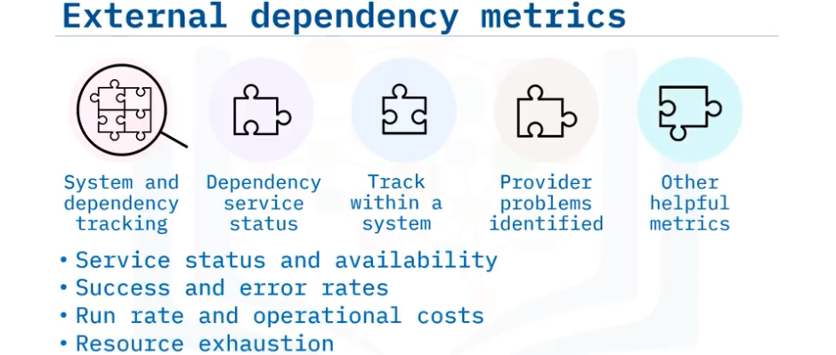

# Monitoring and Observability for Development and DevOps  
## Monitoring  
- Types  
    1. System Monitoring  
          
    2. Dependency Monitoring  
        - If your application isn’t working properly, your dependency monitoring tool could tell you where the error originates from, based on the mapped connections to your application  
    3. Integation Monitoring  
          
    4. Web Performance Monitoring  
          
    5. Business Activity Monitoring  
          
    6. Application Performance Monitoring  
        - IT environment, Infrastructure, Network data, Fast launch and response  
          
          
    7. Real User Monitoring  
        
    8. Security Monitoring  
        - tracks anomalies and ensures that potential threats are stopped before they are a problem.  
- Golden Signals (for SRE)  
      
- Evaluation  
      
- Components  
      
- Qualities 
      
- Metrics  
      
      
      
      
      
## Monitoring Systems & Techniques  
- Synthetic Monitoring (Synthetic testing or Proactive monitoring)  
      
      
      
    - real user monitoring VS synthetic monitoring  
      
- Application Monitoring  
    - Telemetry is system data that is automatically gathered and recorded for monitoring.  
      
      
- Prometheus  
      
- Grafana  
      
- Alerting  
      
> Web transaction: An interaction between a **client**, commonly a web browser, and one or more **databases** as the backend of a multi-tier engineering.  
## Loging  
- Logging & Tracing  
    - Some things to consider logging are an application's incoming and outgoing messages, services and functions, business cases and user journeys, data operations, system events, performance statistics, and threats and vulnerabilities.  
      
      
      
    - Storing log data is required for different reasons, including the reliability of systems, the security posture of environments, improvement in IT systems’ decision-making, and auditing purposes.  
## Observability  
- the ability to understand the internal state of a system based on its external outputs.  
  
- 3 Pillars  
    - Logs capture detailed information about individual events or transactions, giving you a chronological record of what happened.  
    - Metrics are numerical measurements with accompanying attributes that show the health of a particular system component.  
    - Traces are records of the information pathways or workflows that are created to follow a work item, like a transaction.  
      
- Cloud-native  

- Sampling  
    - the practice of collecting only a subset of log events for analysis/storage.  
      
- Telemetry
    - Telemetry is the automated process of collecting and transmitting data from remote or inaccessible sources to support monitoring and analysis.  
    - The key benefits of telemetry include remote feedback, real-time monitoring of application performance, user activity and experience, and network analytics and security.  
      
    - Types  
      
    - Steps  
      
- Tracing for Container-Based Applications  
      
      
> Ingestion: The process where log data is formatted and uploaded from external sources such as applications, hosts, and cloud-based logging services.  